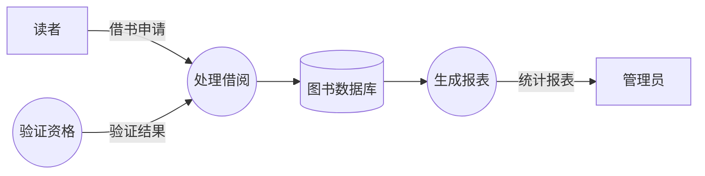
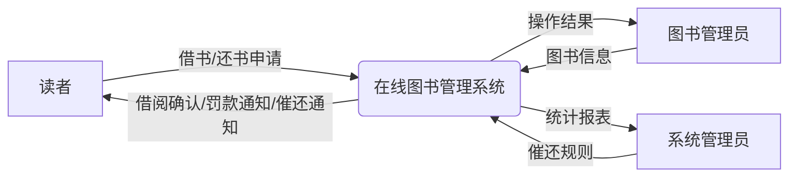
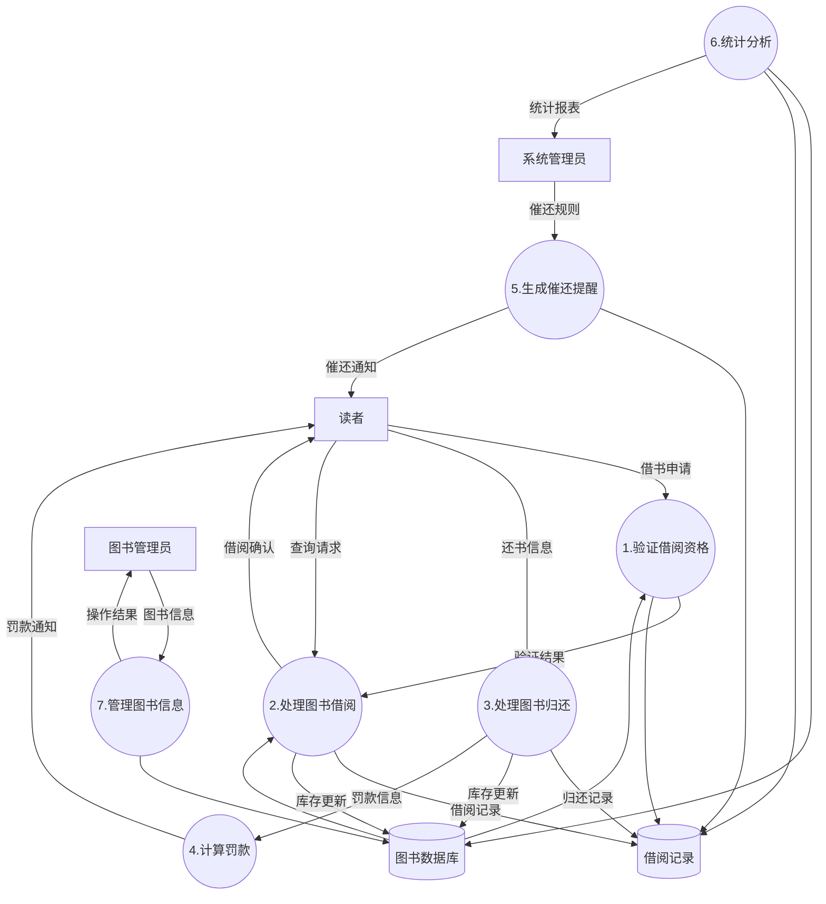
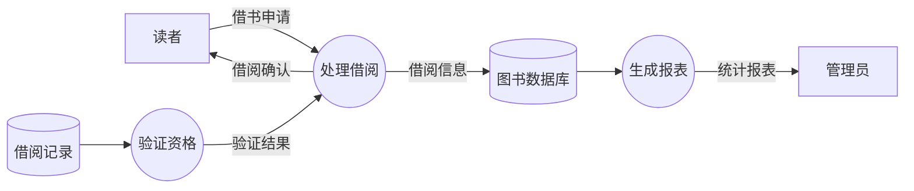

# 专项练习1：数据流图（DFD）

## 知识点总结

### 1. 数据流图基本元素
- **外部实体（External Entity）**：矩形框，表示系统外部的人或组织
- **处理（Process）**：圆形/椭圆，表示对数据的加工处理
- **数据存储（Data Store）**：双横线，表示数据的存储
- **数据流（Data Flow）**：箭头，表示数据的流动方向

### 2. DFD层次
- **上下文图（Context DFD）**：最高层，只有一个处理，展示系统与外部实体的交互
- **0层图（Level 0 DFD）**：将上下文图的处理分解为多个子处理
- **1层图及更低层**：继续细化处理过程

### 3. 常见错误类型
- **黑洞（Black Hole）**：只有输入没有输出的处理
- **奇迹（Miracle）**：只有输出没有输入的处理
- **灰洞（Gray Hole）**：输入不足以产生输出的处理

---

## 练习题目

### 题目背景

某在线图书管理系统（OLMS）旨在为读者、图书管理员和系统管理员提供便捷的图书管理服务。系统主要功能如下：

1. **图书信息管理**：图书管理员可以录入、修改和删除图书信息（书名、作者、ISBN、库存等），这些信息存储在图书数据库中。

2. **借阅管理**：读者通过系统查询图书信息，提交借书申请。系统验证读者的借阅资格（是否有逾期未还、是否达到借阅上限），验证通过后记录借阅信息到借阅记录数据库，并更新图书库存。

3. **归还管理**：读者归还图书时，系统更新借阅记录，计算是否有逾期罚款，如有罚款则生成罚款通知发送给读者，同时更新图书库存。

4. **催还提醒**：系统管理员设置催还规则（提前几天提醒）。系统自动检查借阅记录数据库，对即将到期的借阅生成催还通知发送给读者。

5. **统计分析**：系统管理员可以查询借阅统计报表，系统从借阅记录和图书数据库中提取数据，生成热门图书排行、借阅趋势等分析报告。

### 要求

1. 绘制系统的**上下文数据流图（Context DFD）**（5分）
2. 绘制系统的**0层数据流图（Level 0 DFD）**（7分）
3. 指出下图中存在的数据流图错误，并说明错误类型（3分）

**错误示例图：**

---

## 标准答案

### 1. 上下文数据流图（5分）

**评分标准：**
- 正确识别3个外部实体（读者、图书管理员、系统管理员）：2分
- 正确标注主要数据流（至少4条）：2分
- 系统只有一个处理圆：1分

### 2. 0层数据流图（7分）

**评分标准：**
- 正确识别7个主要处理：3分（每个0.5分，最多扣2分）
- 正确识别2个数据存储（图书数据库、借阅记录）：1分
- 数据流方向正确，逻辑合理：2分
- 外部实体与处理的连接正确：1分

### 3. 错误识别（3分）

**错误分析：**

1. **P3（验证资格）是奇迹（Miracle）**（1.5分）
   - 只有输出"验证结果"给P1，但没有任何输入
   - 验证资格需要从借阅记录数据库读取读者的借阅历史

2. **P1（处理借阅）是黑洞（Black Hole）**（1.5分）
   - 从E1接收"借书申请"，向D1写入数据，但没有输出给读者或其他处理
   - 应该有"借阅确认"或"借阅失败"的反馈给读者

**修正后的图：**

---

## 解题技巧

### 1. 绘制上下文图的步骤
1. **识别外部实体**：谁与系统交互？（人、组织、其他系统）
2. **确定系统边界**：哪些是系统内部处理，哪些是外部？
3. **标注数据流**：外部实体与系统之间传递什么数据？
4. **检查完整性**：每个外部实体至少有一条数据流

### 2. 绘制0层图的步骤
1. **功能分解**：将系统分解为主要功能模块（处理）
2. **识别数据存储**：哪些数据需要持久化保存？
3. **连接数据流**：
   - 外部实体 → 处理
   - 处理 → 数据存储
   - 数据存储 → 处理
   - 处理 → 处理
   - 处理 → 外部实体
4. **命名规范**：
   - 处理：动词短语（如"验证借阅资格"）
   - 数据存储：名词（如"图书数据库"）
   - 数据流：名词（如"借书申请"）

### 3. 检查DFD错误的方法

| 错误类型 | 特征 | 检查方法 |
|---------|------|---------|
| 黑洞 | 只有输入没有输出 | 检查每个处理是否至少有一条输出 |
| 奇迹 | 只有输出没有输入 | 检查每个处理是否至少有一条输入 |
| 灰洞 | 输入不足以产生输出 | 检查输出数据是否能从输入数据中得到 |

### 4. 常见易错点
- ❌ 外部实体之间直接连接数据流
- ❌ 数据存储之间直接连接数据流
- ❌ 数据流没有标注名称
- ❌ 处理没有编号或命名不规范
- ✅ 所有数据流都经过处理
- ✅ 数据流方向明确（箭头）
- ✅ 命名清晰、有意义

---

## 扩展练习

尝试为"在线图书管理系统"的"2.处理图书借阅"绘制1层数据流图，将其进一步分解为：
- 2.1 检查图书库存
- 2.2 记录借阅信息
- 2.3 更新图书状态
- 2.4 生成借阅凭证

（提示：1层图中的外部实体、数据存储应与0层图保持一致，数据流的输入输出也要匹配）

