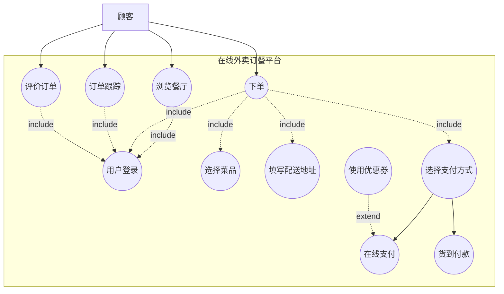
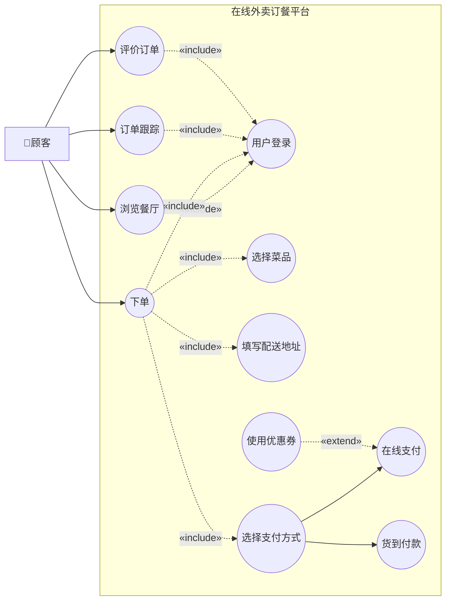
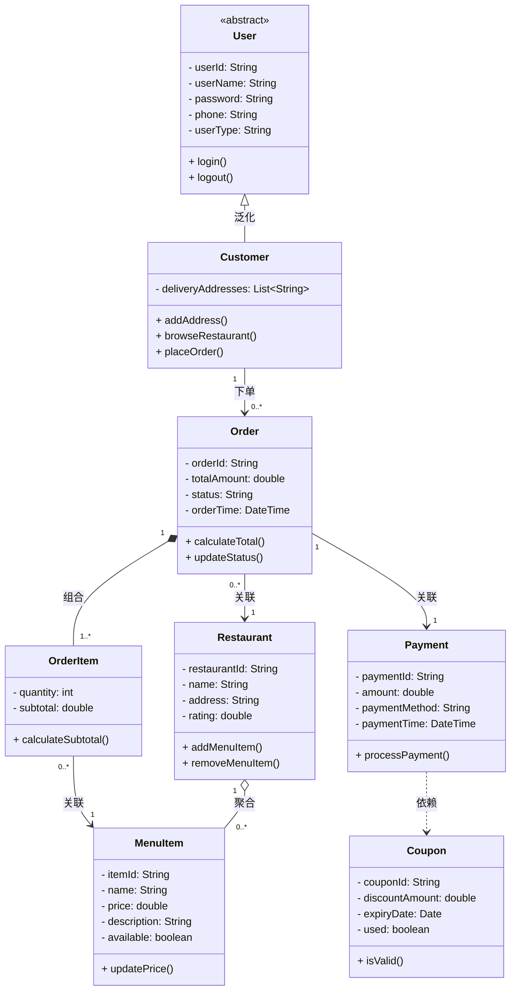
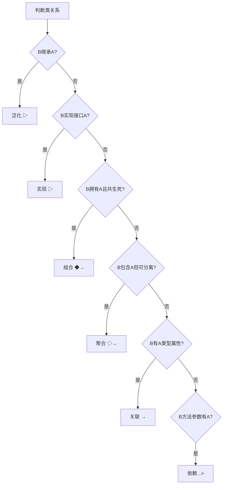

# 专项练习3：UML图（用例图与类图）

## 知识点总结

### 1. 用例图（Use Case Diagram）

#### 基本元素
- **参与者（Actor）**：小人图标，表示与系统交互的外部角色
- **用例（Use Case）**：椭圆，表示系统提供的功能
- **关联（Association）**：实线，连接参与者和用例
- **系统边界**：矩形框，表示系统范围

#### 用例之间的关系

| 关系类型 | 符号 | 含义 | 示例 |
|---------|------|------|------|
| **包含（Include）** | 虚线箭头 + «include» | A包含B，执行A必须执行B | "网上购物"包含"用户登录" |
| **扩展（Extend）** | 虚线箭头 + «extend» | B扩展A，执行A时可选执行B | "支付订单"扩展为"使用优惠券" |
| **泛化（Generalization）** | 实线空心箭头 | 继承关系，子用例继承父用例 | "信用卡支付"泛化自"在线支付" |

**箭头方向记忆：**
- Include：从基础用例 → 被包含用例（依赖方向）
- Extend：从扩展用例 → 基础用例（扩展方向）
- Generalization：从子用例 → 父用例（继承方向）

---

### 2. 类图（Class Diagram）

#### 类的表示
```
┌─────────────────┐
│   类名           │  类名（粗体）
├─────────────────┤
│ - 私有属性       │  属性（- private, + public, # protected）
│ + 公有属性       │
├─────────────────┤
│ + 公有方法()     │  方法（操作）
│ - 私有方法()     │
└─────────────────┘
```

#### 类之间的关系

| 关系类型 | 符号 | 强弱 | 含义 | 代码表现 |
|---------|------|------|------|---------|
| **依赖（Dependency）** | 虚线箭头 | 最弱 | A使用B（临时） | B作为A方法的参数 |
| **关联（Association）** | 实线箭头 | 弱 | A知道B（长期） | A有B类型的属性 |
| **聚合（Aggregation）** | 空心菱形 + 实线 | 中 | A包含B（整体-部分，可分离） | A有B的集合，B可独立存在 |
| **组合（Composition）** | 实心菱形 + 实线 | 强 | A包含B（整体-部分，不可分离） | A拥有B，B随A创建销毁 |
| **泛化（Generalization）** | 空心三角箭头 | 强 | B继承A | class B extends A |
| **实现（Realization）** | 虚线空心三角箭头 | 强 | B实现接口A | class B implements A |

**记忆口诀：**
- 菱形在整体端，箭头指向部分
- 空心菱形：聚合（弱，可分离）—— "大雁与雁群"
- 实心菱形：组合（强，共生死）—— "心脏与人"

#### 多重性（Multiplicity）

| 表示 | 含义 |
|------|------|
| 1 | 恰好1个 |
| 0..1 | 0或1个 |
| * 或 0..* | 0到多个 |
| 1..* | 1到多个 |
| n..m | n到m个 |

---

## 练习题目

### 题目背景

某**在线外卖订餐平台**需要进行系统分析与设计。系统涉及以下角色和功能：

**角色：**
1. **顾客**：可以浏览餐厅、下单、支付、评价
2. **餐厅管理员**：管理菜品、处理订单、查看营业数据
3. **配送员**：接单、配送、确认送达
4. **平台管理员**：管理用户、审核餐厅、处理投诉

**主要功能需求：**

**顾客端：**
1. **用户注册/登录**：新用户注册账号，老用户登录系统（所有功能都需要先登录）
2. **浏览餐厅**：按地理位置、菜系、评分筛选餐厅
3. **下单**：
   - 选择菜品加入购物车
   - 填写配送地址
   - 选择支付方式（在线支付/货到付款）
   - 如果选择在线支付，可以使用优惠券（可选）
4. **订单跟踪**：实时查看订单状态（待接单、制作中、配送中、已完成）
5. **评价订单**：对已完成的订单进行评分和评论

**餐厅管理员端：**
1. **管理菜品**：添加、修改、删除菜品信息
2. **处理订单**：接单、标记制作完成、联系配送
3. **查看统计**：查看销售数据、顾客评价

**配送员端：**
1. **接收订单**：查看待配送订单列表
2. **配送管理**：接单、更新配送状态、确认送达

**平台管理员端：**
1. **审核餐厅**：审核新入驻餐厅的资质
2. **处理投诉**：处理用户和餐厅的投诉

**核心业务类：**
- **用户（User）**：userId, userName, password, phone, userType
- **顾客（Customer）**：继承User，添加deliveryAddresses（配送地址列表）
- **餐厅（Restaurant）**：restaurantId, name, address, rating, menuItems
- **菜品（MenuItem）**：itemId, name, price, description, available
- **订单（Order）**：orderId, customer, restaurant, orderItems, totalAmount, status, orderTime
- **订单项（OrderItem）**：menuItem, quantity, subtotal
- **支付（Payment）**：paymentId, order, amount, paymentMethod, paymentTime
- **优惠券（Coupon）**：couponId, discountAmount, expiryDate, used

**类之间的关系：**
- 顾客与订单：一个顾客可以有多个订单（1对多关联）
- 订单与订单项：一个订单包含多个订单项，订单项不能独立存在（组合）
- 订单与支付：一个订单对应一个支付（1对1关联）
- 订单项与菜品：订单项关联菜品（多对1关联）
- 餐厅与菜品：一个餐厅有多个菜品，菜品属于餐厅（聚合）
- 支付与优惠券：支付可能使用优惠券（依赖）

---

### 问题

#### 第一部分：用例图（15分）

1. 绘制**顾客**的用例图，包括顾客相关的所有用例及用例之间的关系（10分）
2. 说明"下单"与"用户登录"之间应该是什么关系？为什么？（2分）
3. 说明"在线支付"与"使用优惠券"之间应该是什么关系？为什么？（3分）

#### 第二部分：类图（15分）

1. 绘制外卖订餐平台的核心类图，包括：User, Customer, Order, OrderItem, MenuItem, Restaurant, Payment, Coupon（12分）
2. 说明Order与OrderItem之间为什么是组合关系而不是聚合关系？（3分）

---

## 标准答案

### 第一部分：用例图

#### 1. 顾客用例图（10分）



**Mermaid代码说明：**

由于Mermaid的用例图支持有限，这里使用流程图模拟。标准UML用例图应该是：



**评分标准：**
- 正确识别所有顾客相关用例（至少8个主要用例）：3分
- 正确标注include关系（用户登录、选择菜品等）：3分
- 正确标注extend关系（使用优惠券）：2分
- 正确标注泛化关系（在线支付、货到付款）：2分

---

#### 2. "下单"与"用户登录"关系（2分）

**答案：Include（包含）关系**（1分）

**理由：**（1分）
- 执行"下单"功能**必须**先执行"用户登录"
- 这是强制性的前置条件，不是可选的
- 符合include关系的定义：基础用例必须包含被包含用例

**箭头方向：**
```
下单 -.->|«include»| 用户登录
```

---

#### 3. "在线支付"与"使用优惠券"关系（3分）

**答案：Extend（扩展）关系**（1.5分）

**理由：**（1.5分）
- "使用优惠券"是"在线支付"的**可选**扩展功能
- 在线支付可以独立完成，不依赖优惠券
- 只有在顾客选择使用优惠券时才执行
- 符合extend关系的定义：在特定条件下扩展基础用例

**箭头方向：**
```
使用优惠券 -.->|«extend»| 在线支付
```

**易错点：**
- ❌ 不要混淆为include：使用优惠券不是必须的
- ❌ 箭头方向不要反：从扩展用例指向基础用例

---

### 第二部分：类图

#### 1. 核心类图（12分）



**评分标准：**
- 正确定义8个类及其属性和方法：4分（每个类0.5分）
- 正确标注泛化关系（User → Customer）：1分
- 正确标注组合关系（Order ◆→ OrderItem）：2分
- 正确标注聚合关系（Restaurant ◇→ MenuItem）：1.5分
- 正确标注关联关系（Customer → Order, Order → Payment等）：2分
- 正确标注依赖关系（Payment ..> Coupon）：1分
- 正确标注多重性（1, 0..*, 1..*）：0.5分

---

#### 2. Order与OrderItem为什么是组合关系？（3分）

**答案：组合（Composition）关系**（1分）

**理由：**（2分）

1. **生命周期强依赖**（1分）
   - OrderItem的生命周期完全依赖于Order
   - 当Order被删除时，所有OrderItem也必须被删除
   - OrderItem不能独立于Order存在

2. **整体-部分关系，且部分不可分离**（1分）
   - Order是整体，OrderItem是部分
   - 一个OrderItem只能属于一个Order
   - OrderItem不能被多个Order共享
   - OrderItem不能在Order之外单独存在

**对比：为什么不是聚合？**

如果是聚合关系（如Restaurant ◇→ MenuItem）：
- MenuItem可以独立存在（即使餐厅关闭，菜品信息可能仍保留在系统中）
- MenuItem可以被多个订单引用
- MenuItem的生命周期不依赖于Restaurant

**代码体现：**
```java
class Order {
    private List<OrderItem> orderItems; // Order拥有OrderItem
    
    public Order() {
        this.orderItems = new ArrayList<>(); // 创建Order时创建容器
    }
    
    public void addItem(MenuItem item, int quantity) {
        OrderItem orderItem = new OrderItem(item, quantity); // 创建OrderItem
        orderItems.add(orderItem);
    }
    
    // 删除Order时，OrderItem也会被删除（通过垃圾回收）
}
```

---

## 解题技巧

### 1. 用例图关系判断口诀

| 关系 | 判断方法 | 关键词 |
|------|---------|-------|
| Include | "必须" "总是" "前提" | 执行A必须执行B |
| Extend | "可选" "有时" "扩展" | 执行A时可能执行B |
| Generalization | "是一种" "继承" | B是A的一种特殊形式 |

**典型场景：**
- **Include**：登录验证、身份检查、数据验证（强制前置）
- **Extend**：使用优惠、添加备注、紧急处理（可选扩展）
- **Generalization**：支付方式（信用卡/支付宝）、用户类型（管理员/普通用户）

---

### 2. 类图关系强度排序

```
依赖 < 关联 < 聚合 < 组合 ≈ 泛化/实现
```

**判断流程图：**



---

### 3. 多重性标注位置

```
类A -----数字1----- 关系符号 -----数字2----- 类B
      ↑                                    ↑
   B端的数量                            A端的数量
```

**示例：**
```
Customer "1" --> "0..*" Order
含义：1个Customer可以有0到多个Order
```

**常见错误：**
- ❌ 数字位置标反
- ❌ 忘记标注多重性
- ✅ 数字标在对方端

---

### 4. 聚合 vs 组合快速判断

| 判断标准 | 聚合 | 组合 |
|---------|------|------|
| 生命周期 | 独立 | 依赖 |
| 能否共享 | 可以 | 不能 |
| 菱形类型 | 空心◇ | 实心◆ |
| 典型例子 | 大学-教授 | 人-心脏 |

**记忆技巧：**
- 聚合：雁群和大雁（大雁可以换群，可以独立生存）
- 组合：人和心脏（心脏离开人就死了，不能共享）

---

## 扩展练习

### 练习1：补充用例图
为"餐厅管理员"和"配送员"绘制完整的用例图，并标注与顾客用例的关系（如"处理订单"与"下单"的关系）。

### 练习2：类图扩展
在现有类图基础上，添加：
1. **配送（Delivery）类**：deliveryId, deliveryPerson, pickupTime, deliveryTime
2. **评价（Review）类**：reviewId, rating, comment, reviewTime
3. 标注它们与Order的关系

### 练习3：关系辨析
判断以下场景应该使用什么类关系：
1. 汽车与发动机
2. 图书馆与图书
3. 学生与课程
4. 打印机与打印任务

（答案：1.组合 2.聚合 3.多对多关联 4.依赖）

