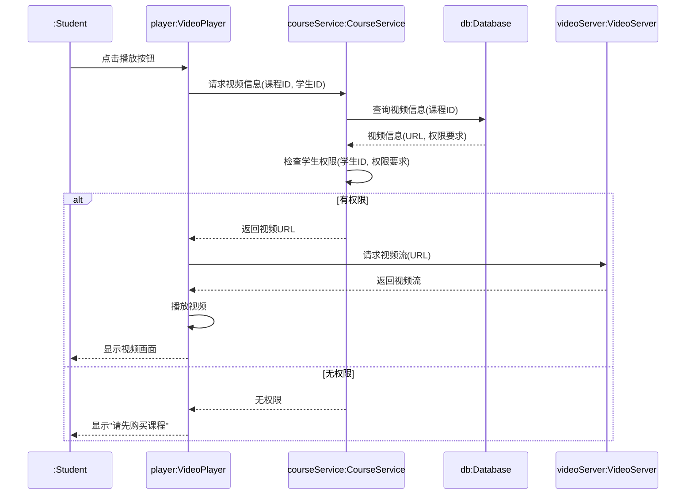

# 专项练习3.1：UML图（顺序图）

## 知识点总结

### 1. 顺序图（Sequence Diagram）基本概念

**顺序图**用于描述对象之间的动态交互，强调消息传递的**时间顺序**。

---

### 2. 基本元素

#### (1) 对象（Object）

**表示形式：** 矩形框

```
┌──────────────┐
│ 对象名:类名   │
└──────────────┘
```

**命名规则：**
- 格式：`对象名:类名`
- 示例：`user1:User`、`:ShoppingCart`（匿名对象）
- 对象名加下划线表示对象

---

#### (2) 生命线（Lifeline）

**表示形式：** 从对象向下的虚线

```
┌──────────────┐
│ user:User    │
└──────────────┘
      ┊
      ┊  ← 生命线（虚线）
      ┊
```

**含义：** 表示对象在时间上的存在

---

#### (3) 激活（Activation）

**表示形式：** 生命线上的窄长矩形

```
┌──────────────┐
│ user:User    │
└──────────────┘
      ┊
     ▐▌  ← 激活框（窄矩形）
     ▐▌
      ┊
```

**含义：** 对象处于活动状态，正在执行操作

---

#### (4) 消息（Message）

| 消息类型 | 符号 | 含义 | 使用场景 |
|---------|------|------|---------|
| **同步消息** | 实线+实心箭头 → | 发送者等待接收者响应 | 方法调用 |
| **异步消息** | 实线+开放箭头 ⇢ | 发送者不等待响应 | 事件通知 |
| **返回消息** | 虚线+开放箭头 ⇠ | 返回结果 | 方法返回值 |
| **创建消息** | 虚线+实心箭头 → | 创建新对象 | new Object() |
| **销毁消息** | 实线+X | 销毁对象 | delete/释放 |
| **自调用** | 回指自己的箭头 ↻ | 对象调用自己的方法 | 递归、内部方法 |

**消息格式：**
```
消息名称(参数): 返回值类型
```

**示例：**
```
login(username, password): boolean
```

---

### 3. 组合片段（Combined Fragment）

用于表示条件、循环等控制结构。

| 类型 | 关键字 | 含义 | 示例 |
|-----|--------|------|------|
| **选择** | alt | if-else | alt [余额充足] / [余额不足] |
| **可选** | opt | if | opt [用户已登录] |
| **循环** | loop | for/while | loop [i < 10] |
| **并行** | par | 并发执行 | par |
| **引用** | ref | 引用其他顺序图 | ref 用户认证 |

---

## 练习题目

### 题目：在线购物系统 - 下单流程（10分）

#### 背景描述

某在线购物系统的下单流程涉及以下对象和操作：

**对象：**
1. **顾客（:Customer）**：发起购买请求
2. **购物车（cart:ShoppingCart）**：管理购买的商品
3. **订单管理器（orderMgr:OrderManager）**：处理订单创建
4. **库存系统（inventory:InventorySystem）**：检查和更新库存
5. **支付系统（payment:PaymentSystem）**：处理支付

**业务流程：**

1. 顾客向购物车发送"查看购物车"请求，购物车返回商品列表
2. 顾客点击"结算"，购物车向订单管理器发送"创建订单"请求（传递商品列表）
3. 订单管理器向库存系统发送"检查库存"请求
4. 库存系统检查库存后返回检查结果（布尔值）
5. **分支判断：**
   - **如果库存充足**：
     - 订单管理器创建订单对象（order:Order）
     - 订单管理器向支付系统发送"处理支付"请求（传递订单金额）
     - 支付系统返回支付结果
     - **如果支付成功**：
       - 订单管理器向库存系统发送"扣减库存"请求
       - 库存系统确认扣减
       - 订单管理器向顾客返回"订单创建成功"
     - **如果支付失败**：
       - 订单管理器向顾客返回"支付失败"
   - **如果库存不足**：
     - 订单管理器向顾客返回"库存不足"

#### 要求

请根据上述流程绘制**顺序图**，要求：
1. 正确标注所有对象（5个对象 + 1个创建的订单对象）（2分）
2. 正确绘制消息传递的顺序和方向（3分）
3. 使用组合片段（alt）表示条件分支（3分）
4. 标注消息名称和参数（2分）

---

## 标准答案

### 顺序图（10分）

```mermaid
sequenceDiagram
    participant C as :Customer
    participant Cart as cart:ShoppingCart
    participant OM as orderMgr:OrderManager
    participant Inv as inventory:InventorySystem
    participant Pay as payment:PaymentSystem
    participant O as order:Order
    
    C->>Cart: 查看购物车()
    Cart-->>C: 商品列表
    
    C->>Cart: 结算()
    Cart->>OM: 创建订单(商品列表)
    
    OM->>Inv: 检查库存(商品列表)
    Inv-->>OM: 检查结果:boolean
    
    alt 库存充足
        create participant O as order:Order
        OM->>O: 创建订单
        
        OM->>Pay: 处理支付(订单金额)
        Pay-->>OM: 支付结果:boolean
        
        alt 支付成功
            OM->>Inv: 扣减库存(商品列表)
            Inv-->>OM: 确认扣减
            OM-->>C: 订单创建成功
        else 支付失败
            OM-->>C: 支付失败
        end
        
    else 库存不足
        OM-->>C: 库存不足
    end
```

---

### 详细说明版（带注释）

**完整顺序图说明：**

#### 1. 对象识别（2分）

| 对象 | 类名 | 说明 |
|------|------|------|
| :Customer | Customer | 顾客（匿名） |
| cart:ShoppingCart | ShoppingCart | 购物车对象 |
| orderMgr:OrderManager | OrderManager | 订单管理器 |
| inventory:InventorySystem | InventorySystem | 库存系统 |
| payment:PaymentSystem | PaymentSystem | 支付系统 |
| order:Order | Order | 订单对象（动态创建） |

**评分标准：**
- 正确识别6个对象：2分
- 遗漏一个扣0.4分

---

#### 2. 消息传递（3分）

**主要消息序列：**

1. `Customer → ShoppingCart`: `查看购物车()`
2. `ShoppingCart → Customer`: `商品列表`（返回消息）
3. `Customer → ShoppingCart`: `结算()`
4. `ShoppingCart → OrderManager`: `创建订单(商品列表)`
5. `OrderManager → InventorySystem`: `检查库存(商品列表)`
6. `InventorySystem → OrderManager`: `检查结果:boolean`
7. `OrderManager → PaymentSystem`: `处理支付(订单金额)`
8. `PaymentSystem → OrderManager`: `支付结果:boolean`
9. `OrderManager → InventorySystem`: `扣减库存(商品列表)`
10. `InventorySystem → OrderManager`: `确认扣减`
11. `OrderManager → Customer`: `订单创建成功` / `支付失败` / `库存不足`

**评分标准：**
- 消息顺序正确：1.5分
- 消息方向正确（箭头方向）：1分
- 返回消息用虚线表示：0.5分

---

#### 3. 组合片段（3分）

**第一层分支（库存检查）：**
```
alt [库存充足]
    ... 创建订单和支付流程 ...
[库存不足]
    返回"库存不足"
end
```

**第二层分支（支付结果）：**
```
alt [支付成功]
    扣减库存 → 返回成功
[支付失败]
    返回"支付失败"
end
```

**评分标准：**
- 正确使用alt表示条件分支：1分
- 第一层分支（库存检查）逻辑正确：1分
- 第二层分支（支付检查）逻辑正确：1分

---

#### 4. 消息标注（2分）

**必须标注的消息：**
- `创建订单(商品列表)`：带参数
- `检查库存(商品列表)`: 带参数
- `检查结果:boolean`: 带返回类型
- `处理支付(订单金额)`: 带参数
- `支付结果:boolean`: 带返回类型

**评分标准：**
- 关键消息有参数标注：1分
- 关键返回消息有类型标注：1分

---

### 文本描述版答案

如果不使用Mermaid，可以这样描述：

```
顺序图：在线购物系统下单流程

对象：
1. :Customer（顾客）
2. cart:ShoppingCart（购物车）
3. orderMgr:OrderManager（订单管理器）
4. inventory:InventorySystem（库存系统）
5. payment:PaymentSystem（支付系统）
6. order:Order（订单，动态创建）

消息序列：
1. Customer → cart: 查看购物车()
2. cart -->> Customer: 商品列表（返回）
3. Customer → cart: 结算()
4. cart → orderMgr: 创建订单(商品列表)
5. orderMgr → inventory: 检查库存(商品列表)
6. inventory -->> orderMgr: 检查结果:boolean（返回）

7. [alt: 库存充足]
   7.1. orderMgr → order: <<create>> 创建订单对象
   7.2. orderMgr → payment: 处理支付(订单金额)
   7.3. payment -->> orderMgr: 支付结果:boolean（返回）
   
   7.4. [alt: 支付成功]
        7.4.1. orderMgr → inventory: 扣减库存(商品列表)
        7.4.2. inventory -->> orderMgr: 确认扣减（返回）
        7.4.3. orderMgr -->> Customer: 订单创建成功（返回）
   [else: 支付失败]
        7.5.1. orderMgr -->> Customer: 支付失败（返回）
   [end alt]

8. [else: 库存不足]
   8.1. orderMgr -->> Customer: 库存不足（返回）
[end alt]
```

---

## 解题技巧

### 1. 顺序图绘制步骤

**口诀：对象、时间、消息、分支**

#### 第一步：确定对象
- 从需求中提取**名词**作为候选对象
- 只包括**参与交互**的对象
- 对象从左到右排列，通常按照**调用顺序**

**技巧：**
```
左侧：发起者（用户、外部系统）
中间：控制器、服务类
右侧：数据存储、外部接口
```

---

#### 第二步：按时间顺序排列消息
- **从上到下**表示时间推移
- 先写主流程，再添加分支
- 返回消息可以省略（如果很明显）

---

#### 第三步：标注消息
- **同步调用**：实线实心箭头（→）
- **异步调用**：实线开放箭头（⇢）
- **返回消息**：虚线开放箭头（⇠）

**标注格式：**
```
消息名称(参数列表): 返回类型
```

**示例：**
```
login(username:String, password:String): boolean
```

---

#### 第四步：添加控制结构
使用组合片段：
- `alt`：选择（if-else）
- `opt`：可选（if）
- `loop`：循环

---

### 2. 对象识别技巧

| 业务场景 | 典型对象 |
|---------|---------|
| **登录** | 用户、登录界面、认证服务、用户数据库 |
| **下单** | 顾客、购物车、订单管理器、库存系统、支付系统 |
| **查询** | 用户、查询界面、查询服务、数据库 |
| **审批** | 申请人、审批表单、审批流程、审批人、数据库 |

---

### 3. 消息类型选择技巧

| 场景 | 消息类型 | 示例 |
|------|---------|------|
| **方法调用** | 同步消息（→） | checkInventory() |
| **事件通知** | 异步消息（⇢） | notify() |
| **返回值** | 返回消息（⇠） | return result |
| **创建对象** | 创建消息（→ 带<<create>>） | new Order() |

---

### 4. 组合片段使用技巧

#### alt（选择）：if-else

```
alt [条件1]
    ... 执行路径1 ...
[条件2]
    ... 执行路径2 ...
[else]
    ... 默认路径 ...
end
```

**典型场景：**
- 登录成功/失败
- 库存充足/不足
- 支付成功/失败

---

#### opt（可选）：if

```
opt [条件]
    ... 可选执行的消息 ...
end
```

**典型场景：**
- 如果是会员，则应用折扣
- 如果有优惠券，则使用优惠券

---

#### loop（循环）：for/while

```
loop [循环条件]
    ... 重复执行的消息 ...
end
```

**典型场景：**
- 遍历购物车中的商品
- 批量处理订单

---

### 5. 常见错误与避免

| 错误类型 | 错误示例 | 正确做法 |
|---------|---------|---------|
| **时间顺序错** | 先返回结果，后调用方法 | 严格按照时间从上到下 |
| **消息方向反** | A调用B，箭头指向A | 箭头从调用者指向被调用者 |
| **遗漏返回消息** | 只有调用，没有返回 | 重要的返回值要标注 |
| **对象过多** | 包含不参与交互的对象 | 只画参与消息传递的对象 |
| **消息不清晰** | 箭头上只写"处理" | 写清楚方法名和参数 |

---

### 6. 与其他UML图的区别

| 图类型 | 关注点 | 何时使用 |
|-------|--------|---------|
| **顺序图** | **时间顺序**、消息传递 | 描述具体交互过程 |
| **协作图** | 对象关系、消息路由 | 强调对象之间的关系 |
| **活动图** | 业务流程、控制流 | 描述业务流程 |
| **状态图** | 对象状态变化 | 描述对象的生命周期 |

**记忆口诀：**
- 顺序图：谁先谁后（时间）
- 协作图：谁和谁说（关系）
- 活动图：做什么（流程）
- 状态图：是什么（状态）

---

## 扩展练习

### 练习1：用户登录流程（5分）

#### 题目

某系统的登录流程如下：
1. 用户在登录界面输入用户名和密码，点击登录
2. 登录界面将用户名和密码发送给认证服务
3. 认证服务向用户数据库查询用户信息
4. 用户数据库返回用户信息
5. 认证服务验证密码：
   - 如果密码正确：生成会话（Session对象），返回"登录成功"
   - 如果密码错误：返回"密码错误"
6. 登录界面显示结果

**涉及对象：**
- :User（用户）
- loginUI:LoginUI（登录界面）
- authService:AuthService（认证服务）
- userDB:UserDatabase（用户数据库）
- session:Session（会话对象，动态创建）

**要求：** 绘制顺序图

---

#### 参考答案

```mermaid
sequenceDiagram
    participant U as :User
    participant UI as loginUI:LoginUI
    participant Auth as authService:AuthService
    participant DB as userDB:UserDatabase
    participant S as session:Session
    
    U->>UI: 输入用户名密码并点击登录
    UI->>Auth: login(username, password)
    Auth->>DB: getUserInfo(username)
    DB-->>Auth: userInfo:User
    
    alt 密码正确
        create participant S as session:Session
        Auth->>S: 创建会话
        Auth-->>UI: 登录成功
        UI-->>U: 显示登录成功
    else 密码错误
        Auth-->>UI: 密码错误
        UI-->>U: 显示密码错误
    end
```

**关键点：**
- 用户数据库返回用户信息（包含正确密码）
- 认证服务在本地验证密码（不是数据库验证）
- 密码正确时才创建Session对象

---

### 练习2：图书借阅流程（扩展）

#### 题目

图书馆借阅流程：
1. 读者向借阅系统提交借书申请（图书ID）
2. 借阅系统检查读者借阅资格（是否有逾期、是否达到借阅上限）
3. 如果资格验证通过：
   - 借阅系统向图书库存系统查询图书状态
   - 如果图书可借：
     - 借阅系统创建借阅记录
     - 借阅系统更新图书状态为"已借出"
     - 返回"借阅成功"
   - 如果图书不可借：
     - 返回"图书不可借"
4. 如果资格验证失败：
   - 返回"借阅资格不符"

**涉及对象：**
- :Reader（读者）
- borrowSystem:BorrowSystem（借阅系统）
- inventorySystem:InventorySystem（图书库存系统）
- record:BorrowRecord（借阅记录，动态创建）

**要求：** 绘制顺序图（提示：需要使用嵌套的alt）

---

#### 参考答案

```mermaid
sequenceDiagram
    participant R as :Reader
    participant BS as borrowSystem:BorrowSystem
    participant IS as inventorySystem:InventorySystem
    participant Rec as record:BorrowRecord
    
    R->>BS: 提交借书申请(图书ID)
    BS->>BS: 检查借阅资格()
    
    alt 资格验证通过
        BS->>IS: 查询图书状态(图书ID)
        IS-->>BS: 图书状态:String
        
        alt 图书可借
            create participant Rec as record:BorrowRecord
            BS->>Rec: 创建借阅记录
            BS->>IS: 更新图书状态(图书ID, "已借出")
            IS-->>BS: 更新成功
            BS-->>R: 借阅成功
        else 图书不可借
            BS-->>R: 图书不可借
        end
        
    else 资格验证失败
        BS-->>R: 借阅资格不符
    end
```

**关键点：**
- 自调用：`BS->>BS: 检查借阅资格()`
- 嵌套alt：外层检查资格，内层检查图书状态
- 创建对象：只有在"资格通过且图书可借"时才创建借阅记录

---

## 真题回顾

### 2023年真题（10分）

某在线教育系统的"视频播放"功能交互如下：

**流程：**
1. 学生点击视频播放按钮
2. 播放器向课程服务请求视频信息（课程ID）
3. 课程服务向数据库查询视频URL和权限
4. 数据库返回视频信息
5. 课程服务检查学生权限：
   - 如果有权限：返回视频URL
   - 如果无权限：返回"无权限"
6. 播放器收到URL后：
   - 向视频服务器请求视频流
   - 视频服务器返回视频流
   - 播放器播放视频
7. 如果无权限，播放器显示"请先购买课程"

**涉及对象：**
- :Student（学生）
- player:VideoPlayer（播放器）
- courseService:CourseService（课程服务）
- db:Database（数据库）
- videoServer:VideoServer（视频服务器）

**要求：** 绘制顺序图（10分）

---

### 参考答案



**评分标准：**
- 对象识别正确（5个对象）：2分
- 消息顺序正确：3分
- 使用alt表示权限判断：2分
- 自调用（检查权限、播放视频）正确：1分
- 消息标注清晰：2分

---

## 总结

### 顺序图的适用场景

✅ **适合用顺序图的情况：**
- 需要展示**时间顺序**
- 多个对象之间的**消息传递**
- 有**条件分支**的交互流程
- 需要展示**对象的创建和销毁**

❌ **不适合用顺序图的情况：**
- 复杂的业务流程（用活动图）
- 对象的状态变化（用状态图）
- 类之间的静态关系（用类图）

---

### 学习建议

1. **多画**：顺序图靠手感，多画几遍就熟练了
2. **从简单开始**：先画2-3个对象的交互，再画复杂的
3. **对比参考答案**：看看自己遗漏了什么消息
4. **注意细节**：箭头方向、消息标注、返回消息

---

### 快速检查清单

绘制完顺序图后，检查：
- [ ] 所有参与交互的对象都画了吗？
- [ ] 消息的时间顺序是从上到下吗？
- [ ] 箭头方向正确吗（从调用者指向被调用者）？
- [ ] 重要的返回消息画了吗？
- [ ] 条件分支用alt标注了吗？
- [ ] 创建的对象用<<create>>标注了吗？
- [ ] 消息名称和参数清晰吗？

---

**祝你学习顺利！** 🎉

