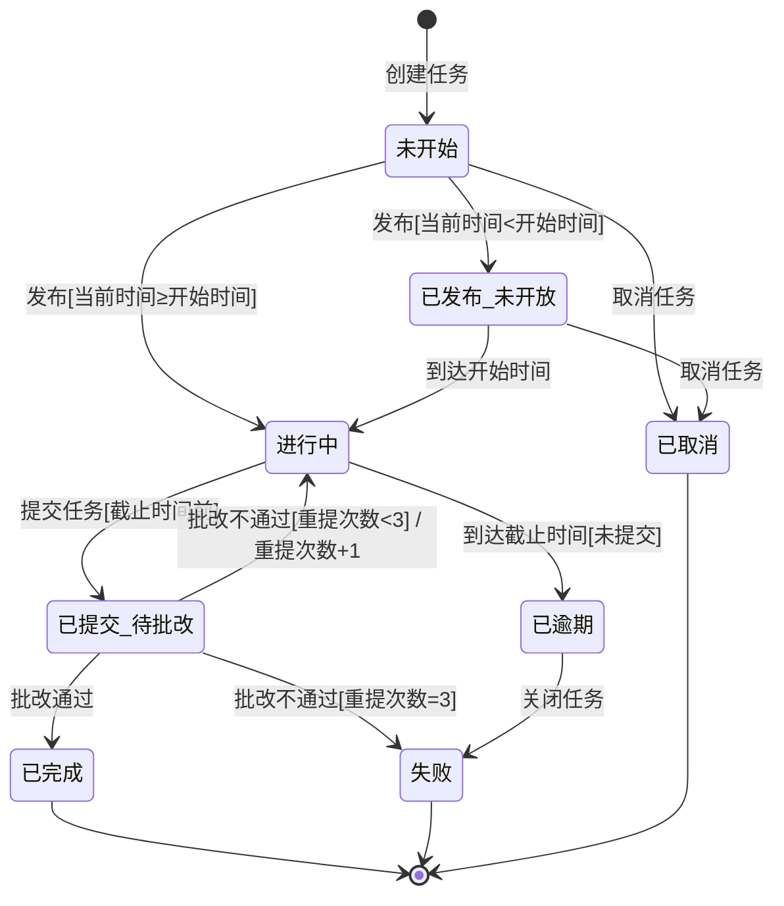
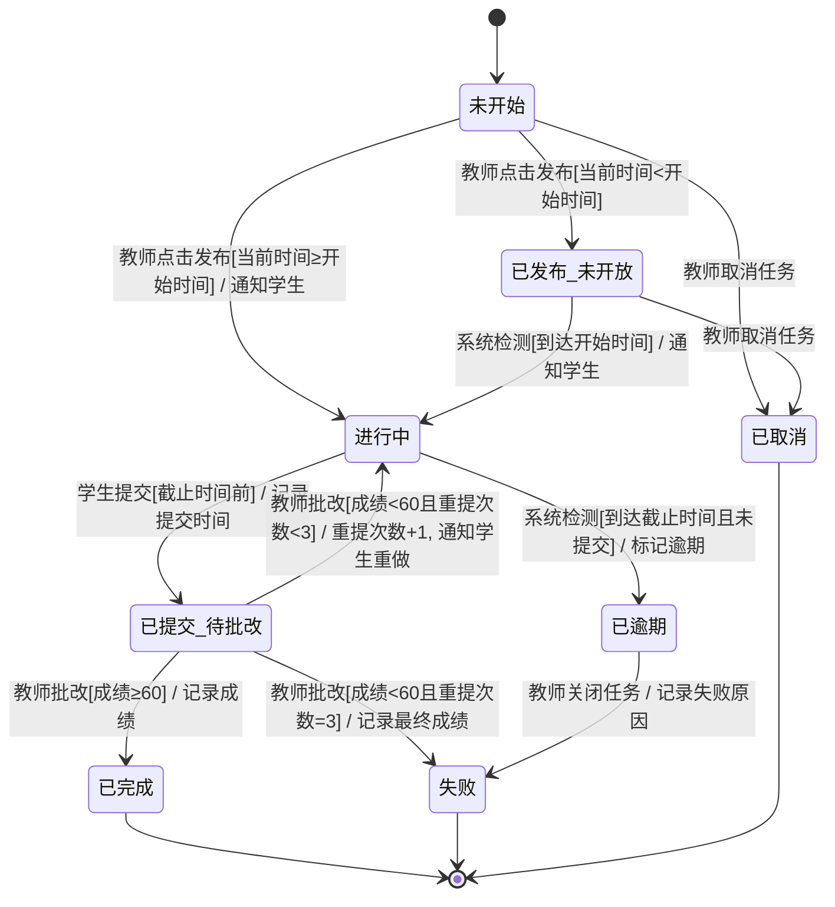
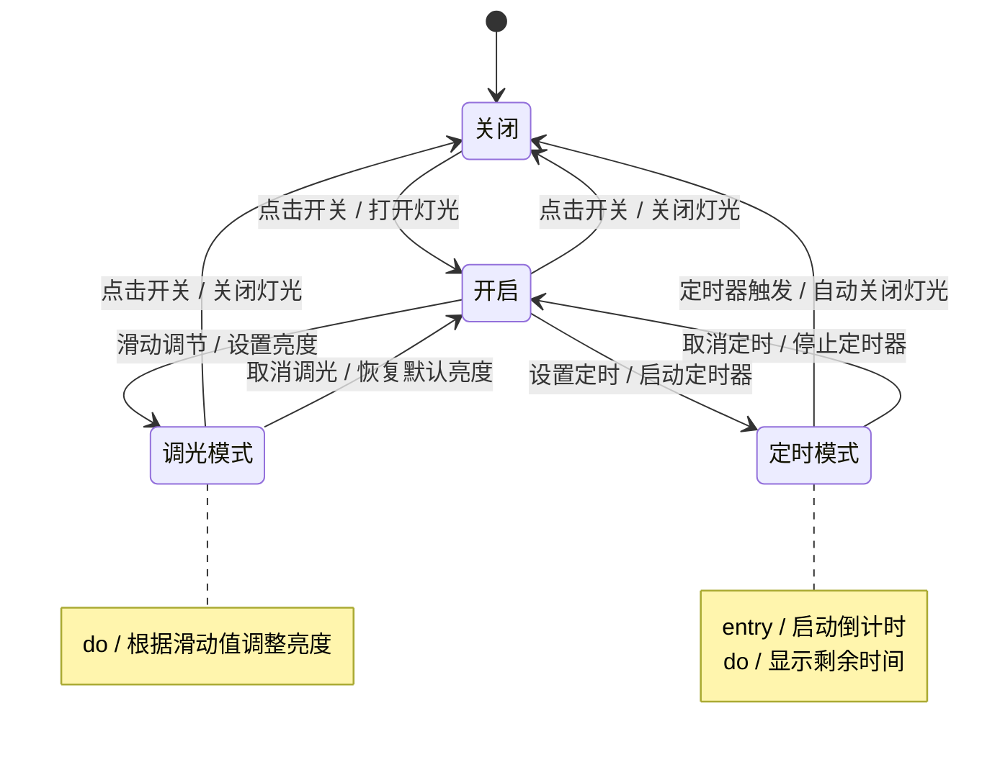
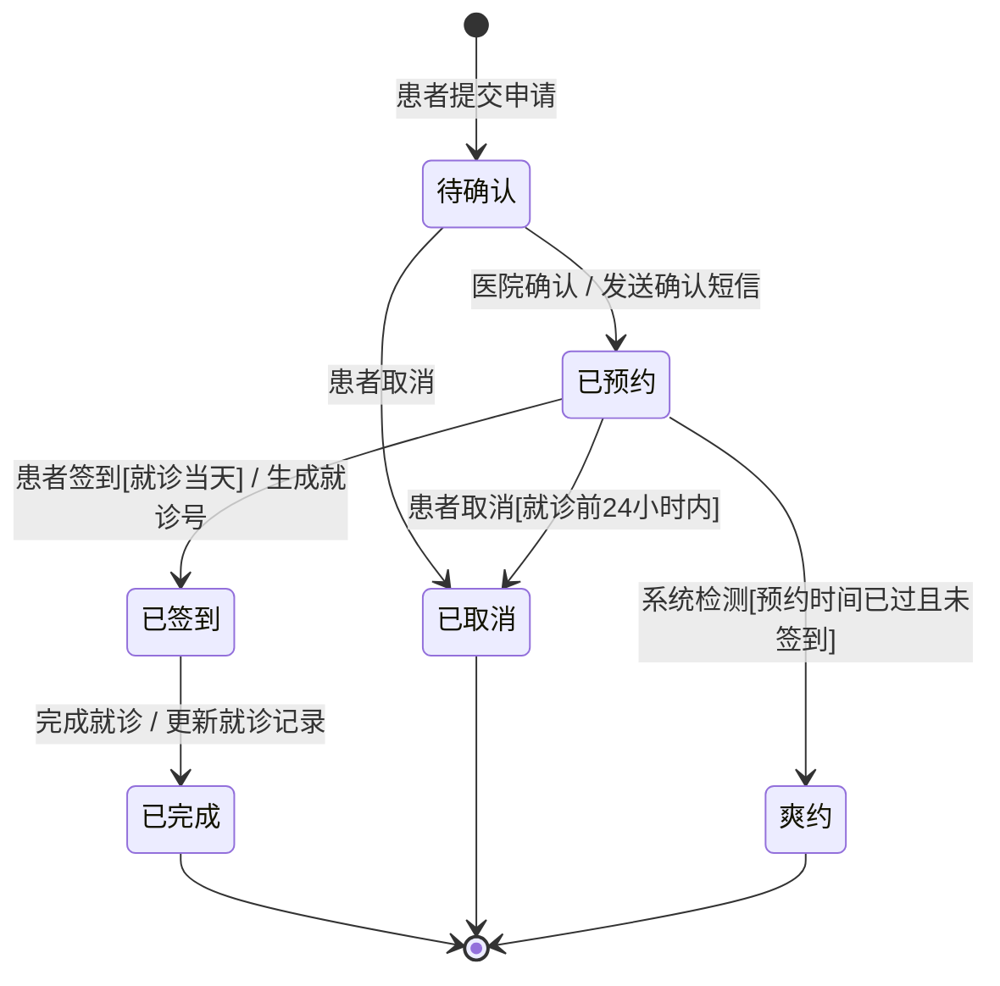

# 专项练习4：状态图（State Diagram）

## 知识点总结

### 1. 状态图基本概念

**状态图（State Diagram）**用于描述对象在其生命周期内的状态变化以及引起状态转换的事件。

#### 基本元素

| 元素 | 符号 | 说明 |
|------|------|------|
| **初始状态** | ● 实心圆 | 对象的起始状态，一个状态图只有一个 |
| **状态** | 圆角矩形 | 对象在某一时刻的条件或情况 |
| **转换** | 箭头 | 从一个状态到另一个状态的变迁 |
| **终止状态** | ◉ 同心圆 | 对象的最终状态，可以有多个或没有 |

#### 状态的表示

```
┌─────────────────────┐
│   状态名             │
├─────────────────────┤
│ entry / 进入动作     │  (可选)
│ do / 内部活动        │  (可选)
│ exit / 退出动作      │  (可选)
└─────────────────────┘
```

#### 转换的表示

```
事件[守卫条件] / 动作
```

- **事件（Event）**：触发状态转换的原因（如：点击按钮、接收消息）
- **守卫条件（Guard Condition）**：[condition]，转换发生的前提条件
- **动作（Action）**：状态转换时执行的操作

**示例：**
```
提交订单[余额充足] / 扣款
```

---

### 2. 状态图绘制步骤

1. **确定对象**：为哪个类/对象绘制状态图？
2. **列出所有状态**：该对象有哪些可能的状态？
3. **找初始和终止状态**：起点和终点是什么？
4. **确定转换**：什么事件导致状态改变？
5. **添加守卫条件**：转换是否有前提条件？
6. **标注动作**：转换时需要执行什么操作？

---

### 3. 常见状态图场景

| 场景 | 典型状态 |
|------|---------|
| 订单 | 待支付 → 待发货 → 已发货 → 已签收 → 已完成 |
| 文档 | 草稿 → 审核中 → 已批准/已拒绝 → 已发布 |
| 借阅 | 可借 → 已借出 → 已归还/已丢失 |
| 任务 | 待分配 → 进行中 → 已暂停 → 已完成/已取消 |

---

## 练习题目

### 题目1：在线课程学习系统（10分）

#### 背景描述

某在线课程学习系统中，**课程任务（Task）**对象的生命周期如下：

1. **创建任务**：教师创建一个新任务（如视频学习、作业、测验），任务进入"**未开始**"状态

2. **发布任务**：
   - 教师设置任务的开始时间和截止时间，点击"发布"
   - 如果当前时间 < 开始时间，任务进入"**已发布-未开放**"状态
   - 如果当前时间 ≥ 开始时间，任务进入"**进行中**"状态

3. **任务进行**：
   - 在"已发布-未开放"状态的任务，当到达开始时间后，自动转换为"**进行中**"状态
   - 学生可以开始完成任务

4. **提交任务**：
   - 学生在截止时间前提交任务，任务进入"**已提交-待批改**"状态
   - 如果到达截止时间但学生未提交，任务自动进入"**已逾期**"状态

5. **批改任务**：
   - 教师批改任务，如果通过，任务进入"**已完成**"状态（终止状态）
   - 如果不通过，任务返回"**进行中**"状态，允许学生重新提交（最多3次机会）
   - 如果已经重新提交3次仍不通过，任务进入"**失败**"状态（终止状态）

6. **取消任务**：
   - 在"未开始"或"已发布-未开放"状态，教师可以取消任务，任务进入"**已取消**"状态（终止状态）

7. **逾期任务**：
   - 在"已逾期"状态，学生不能再提交任务
   - 教师可以选择"关闭任务"，进入"**失败**"状态（终止状态）

#### 要求

请为**课程任务（Task）**对象绘制完整的状态图，包括：
- 所有状态（至少7个）
- 状态之间的转换
- 转换的触发事件
- 必要的守卫条件和动作

---

### 题目2：智能家居灯光控制系统（扩展题，不计分）

#### 背景描述

智能灯泡的状态包括：关闭、开启、调光模式、定时模式。请绘制灯泡的状态图。

**提示：**
- 关闭 ↔ 开启（点击开关）
- 开启 → 调光模式（滑动调节亮度）
- 开启 → 定时模式（设置定时关闭）
- 调光模式/定时模式 → 开启（取消特殊模式）

---

## 标准答案

### 题目1：课程任务状态图（10分）



**详细标注版（推荐答题格式）：**



#### 评分标准（10分）

| 评分项 | 分值 | 说明 |
|-------|------|------|
| **初始和终止状态** | 1分 | 正确标注[*]和三个终止状态 |
| **核心状态识别** | 3分 | 至少包含7个状态：未开始、已发布-未开放、进行中、已提交-待批改、已逾期、已完成、失败、已取消（漏一个扣0.5分）|
| **状态转换** | 3分 | 转换路径正确，逻辑合理（主要路径2分，边界情况1分）|
| **守卫条件** | 2分 | 正确标注守卫条件，如[当前时间<开始时间]、[重提次数<3]等 |
| **动作标注** | 1分 | 至少标注3个动作，如"通知学生"、"重提次数+1"等 |

---

#### 关键知识点解析

1. **条件分支转换**
```
未开始 --> 已发布_未开放 : [当前时间<开始时间]
未开始 --> 进行中 : [当前时间≥开始时间]
```
同一个事件（发布）根据不同条件进入不同状态

2. **带计数器的循环转换**
```
已提交_待批改 --> 进行中 : [重提次数<3] / 重提次数+1
已提交_待批改 --> 失败 : [重提次数=3]
```
通过守卫条件控制循环次数

3. **自动转换**
```
已发布_未开放 --> 进行中 : 到达开始时间
```
由系统时间触发，不需要用户操作

---

### 题目2：智能灯泡状态图（扩展题）



---

## 解题技巧

### 1. 状态图 vs 活动图

| 对比项 | 状态图 | 活动图 |
|-------|--------|--------|
| **关注点** | 对象的状态变化 | 业务流程、操作顺序 |
| **主体** | 单个对象 | 整个系统/多个对象 |
| **核心元素** | 状态 + 转换 | 活动 + 控制流 |
| **使用场景** | 订单状态、任务状态、设备状态 | 业务流程、算法流程 |

**记忆口诀：**
- 状态图：一个对象的一生（从生到死）
- 活动图：一件事情的过程（从开始到结束）

---

### 2. 状态命名规范

| 好的命名 | 不好的命名 | 说明 |
|---------|-----------|------|
| 待支付、已支付 | 支付、支付ing | 用被动态 + 完成状态 |
| 审核中、已批准 | 审核、批准 | 明确"进行中"还是"已完成" |
| 已发布-未开放 | 发布但没开始 | 简洁、规范 |

**推荐前缀：**
- 待-：等待某动作（待支付、待审核）
- 已-：完成某动作（已完成、已取消）
- -ing：正在进行（进行中、配送中）

---

### 3. 守卫条件使用场景

| 场景 | 示例 |
|------|------|
| **数值条件** | [余额≥100]、[重试次数<3] |
| **时间条件** | [当前时间<截止时间] |
| **状态条件** | [用户已登录]、[库存>0] |
| **权限条件** | [用户角色=管理员] |

**注意：**
- 守卫条件放在方括号[]内
- 多个条件用 and/or 连接：[余额≥100 and 用户已登录]

---

### 4. 动作标注的时机

| 类型 | 语法 | 示例 | 说明 |
|------|------|------|------|
| **转换动作** | 事件 / 动作 | 提交订单 / 扣款 | 转换发生时立即执行 |
| **进入动作** | entry / 动作 | entry / 启动定时器 | 进入状态时执行 |
| **内部活动** | do / 动作 | do / 播放视频 | 停留在状态期间持续执行 |
| **退出动作** | exit / 动作 | exit / 关闭连接 | 离开状态时执行 |

---

### 5. 常见错误与避免

| 错误类型 | 示例 | 正确做法 |
|---------|------|---------|
| **状态太细** | "点击按钮"作为状态 | 点击是事件，不是状态 |
| **缺少终止状态** | 所有路径都没有结束 | 至少有一条路径到达[*] |
| **状态重复** | "进行中"和"执行中" | 统一命名，避免语义重复 |
| **忘记守卫条件** | 同一事件多个转换无条件 | 必须用[]区分条件 |
| **箭头方向错** | A ← 事件 ← B | 应该是 A → 事件 → B |

---

### 6. 检查清单

绘制完状态图后，检查以下项：

- [ ] 是否有且仅有一个初始状态[*]？
- [ ] 是否至少有一条路径到达终止状态？
- [ ] 每个状态是否都有流出的转换？（除了终止状态）
- [ ] 同一事件的多个转换是否有互斥的守卫条件？
- [ ] 状态名是否清晰、无歧义？
- [ ] 转换上是否标注了触发事件？
- [ ] 是否遗漏了重要的业务状态？

---

## 扩展练习

### 练习1：电梯系统
为电梯绘制状态图，包括：
- 状态：停止、上行、下行、开门、关门、故障
- 考虑：楼层检测、安全传感器、超重警报

### 练习2：ATM取款
为ATM取款过程绘制状态图，包括：
- 状态：空闲、验证中、主菜单、取款中、打印凭条
- 考虑：密码错误次数限制、余额不足

### 练习3：视频播放器
为视频播放器绘制状态图，包括：
- 状态：停止、播放、暂停、快进、快退、加载中
- 考虑：网络断开、缓冲区不足

---

## 真题回顾

**2023年真题（10分）：**

某医院挂号系统中，**预约挂号**对象的状态变化如下：
1. 患者提交预约申请，进入"待确认"状态
2. 医院确认预约，进入"已预约"状态
3. 患者可以在就诊前24小时取消预约，进入"已取消"状态
4. 就诊当天，患者到医院签到，进入"已签到"状态
5. 如果患者未在预约时间前签到，系统自动标记为"爽约"状态
6. 签到后，完成就诊，进入"已完成"状态

请绘制"预约挂号"的状态图。

**参考答案：**



**评分要点：**
- 6个状态（待确认、已预约、已签到、已完成、已取消、爽约）：3分
- 转换路径正确：3分
- 守卫条件（就诊当天、就诊前24小时内）：2分
- 动作标注（发送短信、生成就诊号）：2分

