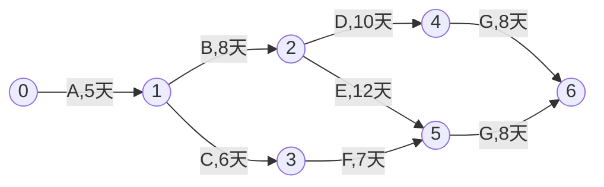
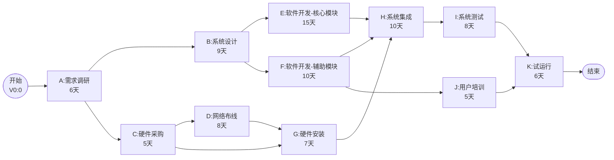

# 专项练习5：关键路径法（CPM）

## 知识点总结

### 1. 关键路径法（Critical Path Method）基本概念

**关键路径法（CPM）**是一种项目管理技术，用于：
- 计算项目最短完成时间
- 识别关键活动（不能延迟的活动）
- 计算活动的时间余量（浮动时间）

---

### 2. 核心术语

| 术语 | 英文 | 含义 |
|------|------|------|
| **最早开始时间** | ES (Earliest Start) | 活动最早可以开始的时间 |
| **最早完成时间** | EF (Earliest Finish) | 活动最早可以完成的时间 |
| **最晚开始时间** | LS (Latest Start) | 活动最晚必须开始的时间（不影响项目工期） |
| **最晚完成时间** | LF (Latest Finish) | 活动最晚必须完成的时间（不影响项目工期） |
| **总时差** | TF (Total Float) | 活动可以延迟的最大时间（不影响项目工期） |
| **自由时差** | FF (Free Float) | 活动可以延迟的最大时间（不影响后续活动） |
| **关键活动** | Critical Activity | 总时差为0的活动 |
| **关键路径** | Critical Path | 由关键活动组成的路径，决定项目工期 |

---

### 3. 计算步骤

#### 第一步：正向计算（求ES和EF）

从项目起点开始，向终点推进：

```
ES(起点) = 0
EF = ES + 持续时间
ES(后续活动) = max(所有前置活动的EF)
```

#### 第二步：确定项目工期

```
项目工期 = max(所有终点活动的EF)
```

#### 第三步：反向计算（求LS和LF）

从项目终点开始，向起点推进：

```
LF(终点) = EF(终点) = 项目工期
LS = LF - 持续时间
LF(前置活动) = min(所有后续活动的LS)
```

#### 第四步：计算时差

```
总时差 TF = LS - ES = LF - EF
自由时差 FF = min(所有后续活动的ES) - EF
```

#### 第五步：确定关键路径

```
关键活动：TF = 0
关键路径：连接所有关键活动的路径
```

---

### 4. AOE网络图（Activity On Edge）

用边表示活动，节点表示事件（里程碑）：



---

## 练习题目

### 题目：智慧校园建设项目（10分）

#### 背景描述

某大学计划建设智慧校园系统，项目包含以下活动：

| 活动代号 | 活动名称 | 前置活动 | 持续时间（天） |
|---------|---------|---------|--------------|
| A | 需求调研 | - | 6 |
| B | 系统设计 | A | 9 |
| C | 硬件采购 | A | 5 |
| D | 网络布线 | C | 8 |
| E | 软件开发-核心模块 | B | 15 |
| F | 软件开发-辅助模块 | B | 10 |
| G | 硬件安装 | C, D | 7 |
| H | 系统集成 | E, F, G | 10 |
| I | 系统测试 | H | 8 |
| J | 用户培训 | F | 5 |
| K | 试运行 | I, J | 6 |

**注意：**
- 活动G需要C和D都完成后才能开始
- 活动H需要E、F、G都完成后才能开始
- 活动K需要I和J都完成后才能开始

#### 问题

1. 绘制项目的AOE网络图（Mermaid格式）（2分）
2. 计算项目的最短完成时间（2分）
3. 确定项目的关键路径（2分）
4. 计算活动F和活动D的总时差（2分）
5. 计算活动C的自由时差（2分）

---

## 标准答案

### 1. AOE网络图（2分）



**评分标准：**
- 正确表示所有活动和依赖关系：1分
- 正确标注持续时间：0.5分
- 图形结构清晰合理：0.5分

---

### 2. 项目最短完成时间（2分）

#### 正向计算（ES和EF）

| 活动 | 前置活动 | 持续时间 | ES（最早开始） | EF（最早完成） | 计算说明 |
|------|---------|---------|--------------|--------------|---------|
| A | - | 6 | 0 | 6 | 起点活动 |
| B | A | 9 | 6 | 15 | ES=6, EF=6+9 |
| C | A | 5 | 6 | 11 | ES=6, EF=6+5 |
| D | C | 8 | 11 | 19 | ES=11, EF=11+8 |
| E | B | 15 | 15 | 30 | ES=15, EF=15+15 |
| F | B | 10 | 15 | 25 | ES=15, EF=15+10 |
| G | C, D | 7 | max(11,19)=19 | 26 | 等待C和D都完成 |
| H | E, F, G | 10 | max(30,25,26)=30 | 40 | 等待E、F、G都完成 |
| I | H | 8 | 40 | 48 | ES=40, EF=40+8 |
| J | F | 5 | 25 | 30 | ES=25, EF=25+5 |
| K | I, J | 6 | max(48,30)=48 | 54 | 等待I和J都完成 |

**答案：项目最短完成时间 = 54天**（2分）

**评分标准：**
- 正向计算过程正确：1分
- 最终答案正确：1分

---

### 3. 关键路径（2分）

#### 反向计算（LS和LF）

从终点开始反推（项目工期=54天）：

| 活动 | EF | LF（最晚完成） | LS（最晚开始） | 计算说明 |
|------|----|--------------|--------------| -------|
| K | 54 | 54 | 48 | LF=54, LS=54-6 |
| I | 48 | 48 | 40 | LF=48（K的LS），LS=48-8 |
| J | 30 | 48 | 43 | LF=48（K的LS），LS=48-5 |
| H | 40 | 40 | 30 | LF=40（I的LS），LS=40-10 |
| G | 26 | 30 | 23 | LF=30（H的LS），LS=30-7 |
| F | 25 | 30 | 20 | LF=min(30,43)=30，LS=30-10 |
| E | 30 | 30 | 15 | LF=30（H的LS），LS=30-15 |
| D | 19 | 23 | 15 | LF=23（G的LS），LS=23-8 |
| C | 11 | 15 | 10 | LF=min(15,23)=15，LS=15-5 |
| B | 15 | 15 | 6 | LF=min(15,20)=15，LS=15-9 |
| A | 6 | 6 | 0 | LF=min(6,10)=6，LS=6-6 |

#### 计算总时差（TF）

| 活动 | ES | LS | TF（总时差） | 是否关键活动 |
|------|----|----|------------|------------|
| A | 0 | 0 | 0 | ✓ |
| B | 6 | 6 | 0 | ✓ |
| C | 6 | 10 | 4 | |
| D | 11 | 15 | 4 | |
| E | 15 | 15 | 0 | ✓ |
| F | 15 | 20 | 5 | |
| G | 19 | 23 | 4 | |
| H | 30 | 30 | 0 | ✓ |
| I | 40 | 40 | 0 | ✓ |
| J | 25 | 43 | 18 | |
| K | 48 | 48 | 0 | ✓ |

**答案：关键路径为 A → B → E → H → I → K**（2分）

**验证：**
- 路径长度：6 + 9 + 15 + 10 + 8 + 6 = 54天 ✓

**评分标准：**
- 正确识别所有关键活动（TF=0）：1分
- 正确标注关键路径：1分

---

### 4. 活动F和活动D的总时差（2分）

从上表可知：

**活动F的总时差：**
```
TF(F) = LS(F) - ES(F) = 20 - 15 = 5天
```

**活动D的总时差：**
```
TF(D) = LS(D) - ES(D) = 15 - 11 = 4天
```

**答案：**
- 活动F的总时差：**5天**（1分）
- 活动D的总时差：**4天**（1分）

**含义：**
- 活动F可以延迟最多5天而不影响项目工期
- 活动D可以延迟最多4天而不影响项目工期

---

### 5. 活动C的自由时差（2分）

**自由时差（FF）**：活动可以延迟的最大时间，且不影响任何后续活动的最早开始时间

**活动C的后续活动：**
- D（ES=11）
- G（ES=19）

**计算：**
```
FF(C) = min(所有后续活动的ES) - EF(C)
      = min(ES(D), ES(G)) - EF(C)
      = min(11, 19) - 11
      = 11 - 11
      = 0天
```

**答案：活动C的自由时差为 0天**（2分）

**含义：**
- 活动C的最早完成时间是11天
- 后续活动D的最早开始时间也是11天
- C完成后，D必须立即开始，否则会影响D的最早开始时间
- 因此C没有自由时差

**评分标准：**
- 正确计算自由时差：1.5分
- 正确解释含义：0.5分

---

## 解题技巧

### 1. 正向计算快速技巧

**口诀：从左到右，取最大**

```
ES(起点) = 0
EF = ES + 持续时间
ES(后续) = max(所有前置的EF)
```

**多前置活动的处理：**
```
活动H前置E、F、G：
ES(H) = max(EF(E), EF(F), EF(G))
      = max(30, 25, 26)
      = 30
```

---

### 2. 反向计算快速技巧

**口诀：从右到左，取最小**

```
LF(终点) = EF(终点)
LS = LF - 持续时间
LF(前置) = min(所有后续的LS)
```

**多后续活动的处理：**
```
活动F后续H、J：
LF(F) = min(LS(H), LS(J))
      = min(30, 43)
      = 30
```

---

### 3. 时差计算公式汇总

| 时差类型 | 公式1 | 公式2 |
|---------|------|------|
| 总时差TF | LS - ES | LF - EF |
| 自由时差FF | min(后续ES) - EF | - |

**关系：** FF ≤ TF

---

### 4. 关键路径判断标准

✅ **关键活动的特征：**
1. TF = 0（总时差为0）
2. ES = LS（最早=最晚开始）
3. EF = LF（最早=最晚完成）

✅ **关键路径的特征：**
1. 由所有关键活动组成
2. 从起点到终点的最长路径
3. 决定项目最短工期
4. 可能有多条关键路径

---

### 5. 常见易错点

| 易错点 | 错误做法 | 正确做法 |
|-------|---------|---------|
| **多前置活动** | 用加法：ES=EF1+EF2 | 用max：ES=max(EF1,EF2) |
| **多后续活动** | 只看一个后续 | 用min：LF=min(LS1,LS2) |
| **自由时差** | 用TF代替 | 单独计算：min(后续ES)-EF |
| **关键路径** | 只看时间最长的活动 | 看TF=0的活动序列 |
| **反向计算起点** | 随意设LF | LF(终点)=EF(终点) |

---

### 6. 检查清单

计算完成后，检查以下项：

- [ ] 正向计算：所有活动的EF都已计算？
- [ ] 项目工期 = 最后活动的EF？
- [ ] 反向计算：LF(终点) = EF(终点)？
- [ ] 关键路径：长度 = 项目工期？
- [ ] 所有关键活动的TF = 0？
- [ ] 自由时差 ≤ 总时差？
- [ ] 逻辑合理：LS ≥ ES，LF ≥ EF？

---

## 扩展练习

### 练习1：赶工分析

在上题中，如果客户要求项目在50天内完成（而不是54天），应该对哪些活动进行赶工？赶工的优先顺序是什么？

**提示：**
1. 只有关键活动需要赶工
2. 优先选择赶工成本低的活动
3. 关键路径：A → B → E → H → I → K

### 练习2：资源分配

在上题中，如果每个开发人员只能同时参与一个开发活动，活动E和活动F能否并行进行？如何调整进度计划？

### 练习3：风险应对

在上题中，活动F的总时差为5天。如果活动F存在延期风险，应该采取什么措施？

**答案提示：**
- TF=5天，可以容忍5天内的延期
- 如果延期超过5天，F会变成关键活动
- 应该监控F的进度，预留应急措施

---

## 真题回顾

**2022年真题（10分）：**

某软件项目包含以下活动：

| 活动 | 前置活动 | 持续时间 |
|-----|---------|---------|
| A | - | 4 |
| B | A | 6 |
| C | A | 5 |
| D | B | 7 |
| E | B, C | 8 |
| F | C | 6 |
| G | D, E, F | 5 |

计算：
1. 项目最短工期
2. 关键路径
3. 活动C和F的总时差

**答案：**

**正向计算：**
- A: ES=0, EF=4
- B: ES=4, EF=10
- C: ES=4, EF=9
- D: ES=10, EF=17
- E: ES=max(10,9)=10, EF=18
- F: ES=9, EF=15
- G: ES=max(17,18,15)=18, EF=23

**项目工期：23天**

**反向计算：**
- G: LF=23, LS=18
- F: LF=18, LS=12
- E: LF=18, LS=10
- D: LF=18, LS=11
- C: LF=min(10,12)=10, LS=5
- B: LF=min(11,10)=10, LS=4
- A: LF=min(4,5)=4, LS=0

**总时差：**
- A: 0-0=0 ✓
- B: 4-4=0 ✓
- C: 5-4=1
- D: 11-10=1
- E: 10-10=0 ✓
- F: 12-9=3
- G: 18-18=0 ✓

**关键路径：A → B → E → G（4+6+8+5=23天）**

**活动C总时差：1天**
**活动F总时差：3天**

