# 软件工程期末复习资料

> 考试时间：2026年1月6日（周一-周三）  
> 题型：共6道大题，总分100分

---

## 📋 考试题型结构

| 题号 | 考点 | 分值 | 题量 | 难度 |
|------|------|------|------|------|
| 第1题 | 数据流图 | 15分 | 4小题 | ⭐⭐⭐ |
| 第2题 | 可行性分析 | 20分 | 3-4小题 | ⭐ (送分题) |
| 第3题 | UML图（用例图、类图、状态图） | 30分 | 3小题 | ⭐⭐⭐⭐ |
| 第4题 | 状态图绘制 | 10分 | 1题 | ⭐⭐⭐ |
| 第5题 | 项目管理（关键路径法） | 10分 | 2小题 | ⭐⭐⭐ |
| 第6题 | 软件测试 | 15分 | 若干小题 | ⭐⭐ |

**注意事项：**
- 题目描述会很长，像语文阅读理解，需要耐心审题
- 重点复习老师给的复习资料，掌握解题思路
- 目标：90分以上

---

## 第1题 数据流图相关内容（15分）

### 核心知识点

#### 1. 数据流图的基本概念
数据流图（Data Flow Diagram, DFD）是结构化分析方法的主要工具，用于描述系统的逻辑模型。

**四大基本元素：**
- **数据流**：用箭头表示，箭头上标注数据名称
- **加工/处理**：用圆形或圆角矩形表示，描述数据的处理过程
- **数据存储**：用两条平行线表示（D1、D2等）
- **外部实体**：用方框表示（E1、E2等），表示系统外部的人或物

#### 2. 数据流图的层次结构
- **上下文图（顶层图）**：只有一个加工，表示整个系统
- **0层图**：将顶层图分解为若干主要加工
- **1层图、2层图...**：继续细化分解

#### 3. 数据流图的分解原则
- **父图与子图平衡**：子图的输入输出数据流必须与父图一致
- **保持一致性**：命名、数据流方向要统一

#### 4. 常见错误（重要！）
1. **黑洞（Black Hole）**：有输入无输出的加工
2. **奇迹（Miracle）**：有输出无输入的加工
3. **灰洞（Gray Hole）**：输入不足以产生输出的加工

### 典型例题：智慧农业平台

#### 系统说明
某现代农业种植基地为进一步提升农作物种植过程的智能化，欲开发智慧农业平台，集管理和销售于一体，该平台的主要功能有:

1. **信息维护**。农业专家对农作物、环境等监测数据的监控处理规则进行维护。

2. **数据采集**。获取传感器上传的农作物长势、土壤墒情、气候等连续监测数据，解析后将监测信息进行数据处理、可视化和存储等操作。

3. **数据处理**。对实时监测信息根据监控处理规则进行监测分析，将分析结果进行可视化并进行存储、远程控制，对历史监测信息进行综合统计和预测，将预测信息进行可视化和存储。

4. **远程控制**。根据监控处理规则对分析结果进行判定，依据判定结果自动对控制器进行远程控制。平台也可以根据农业人员提供的控制信息对控制器进行远程控制。

5. **可视化**。实时向农业人员展示监测信息:实时给农业专家展示统计分析结果和预测信息或根据农业专家请求进行展示。

#### 问题1（4分）
使用说明中的词语，给出图1-1中的实体E1~E4的名称。

**图1-1 上下文数据流图：**

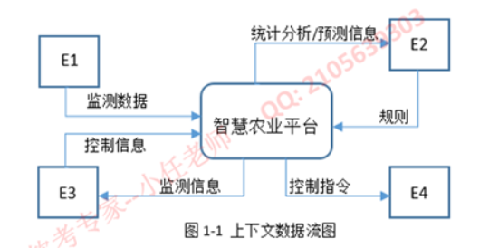

**Mermaid可视化：**
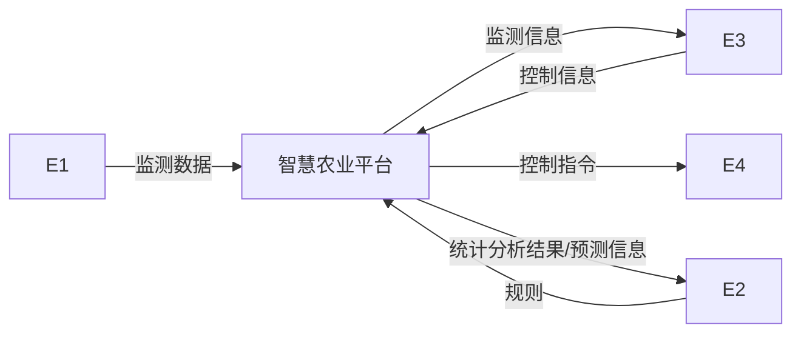

**解题思路：**
- 外部实体是与系统交互的外部角色或系统
- 从需求描述中找出与系统交互的外部对象
- 分析数据流的方向，判断实体的角色
- 常见实体：用户、传感器、控制器、外部系统等

**标准答案：**
- **E1：传感器**（向系统发送监测数据）
- **E2：农业专家**（维护规则，查看分析结果）
- **E3：农业人员**（查看监测信息）
- **E4：控制器**（接收控制指令）

#### 问题2（4分）
使用说明中的词语，给出图1-2中的数据存储D1~D4的名称。

**图1-2 0层数据流图：**

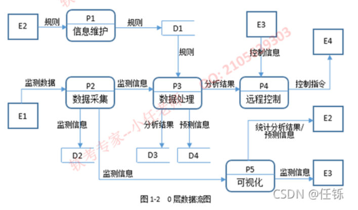

**Mermaid可视化：**
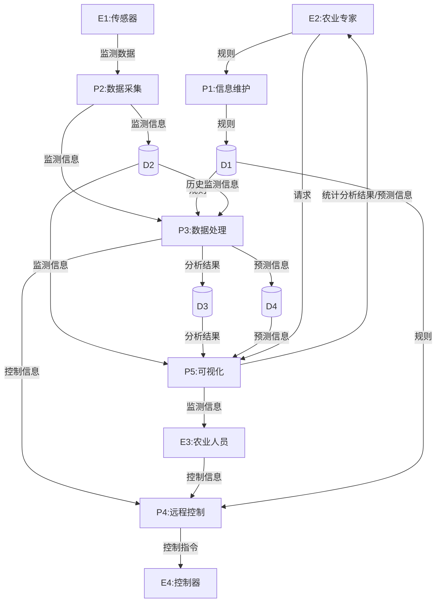

**解题思路：**
- 数据存储是系统中需要持久化保存的数据
- 从需求中找出"存储"、"保存"等关键词
- 分析哪些数据需要保存
- 查看数据存储与哪些加工相连，判断其作用

**标准答案：**
- **D1：监控处理规则表**（农业专家维护，数据处理和远程控制使用）
- **D2：监测信息表**（存储传感器采集的数据）
- **D3：分析结果表**（存储实时监测分析的结果）
- **D4：预测信息表**（存储历史数据的统计预测结果）

#### 问题3（4分）
根据说明和图中术语，补充图1-2中缺失的数据流及其起点和终点。

**参考答案图：**

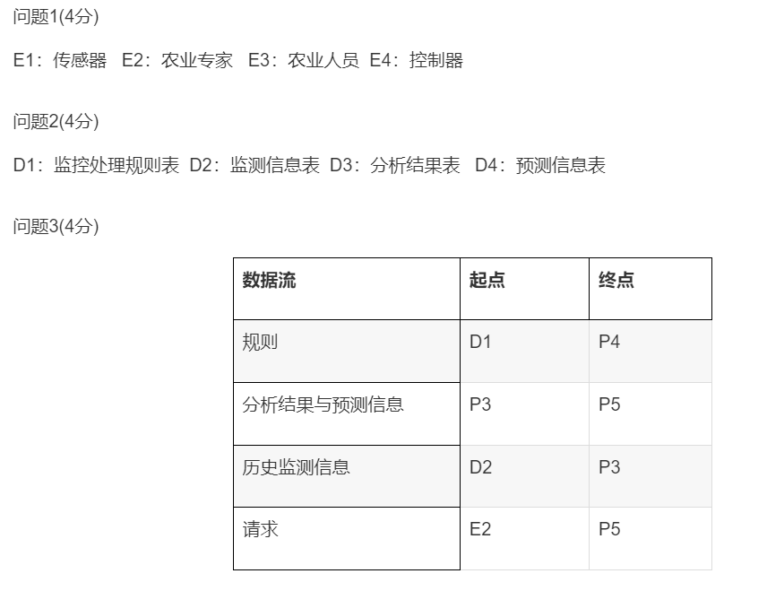

**解题思路：**
- 检查每个加工的输入输出是否完整
- 根据需求描述补充缺失的数据流
- 注意数据流的方向和命名
- 避免黑洞（只有输入没输出）和奇迹（只有输出没输入）

**标准答案表格：**

| 数据流 | 起点 | 终点 |
|--------|------|------|
| 规则 | D1 | P4 |
| 分析结果与预测信息 | P3 | P5 |
| 历史监测信息 | D2 | P3 |
| 请求 | E2 | P5 |

**答题要点：**
1. **规则：D1→P4**
   - P4（远程控制）需要根据监控处理规则进行判定
   
2. **分析结果与预测信息：P3→P5**
   - P3（数据处理）产生的分析和预测结果需要通过P5可视化展示
   
3. **历史监测信息：D2→P3**
   - P3需要从D2读取历史数据进行统计和预测
   
4. **请求：E2→P5**
   - 农业专家可以主动请求查看信息

#### 问题4（3分）
根据说明，"数据处理"可以分解为哪些子加工？进一步进行分解时，需要注意哪三种常见的错误？

**标准答案：**

**"数据处理"可以分解为如下三个子加工：**
1. **实时监测信息的监测分析**
2. **历史监测信息综合统计和预测**
3. **可视化和存储**

**数据流图中常见的3种错误：**
1. **有输入但是没有输出**，我们称之为"**黑洞**"（Black Hole）
2. **有输出但没有输入**，我们称之为"**奇迹**"（Miracle）
3. **输入不足以产生输出**，我们称之为"**灰洞**"（Gray Hole）

**记忆技巧：**
- 黑洞：吃进去不出来（只进不出）
- 奇迹：无中生有（只出不进）
- 灰洞：输入不够用（输入输出不匹配）

**检查方法：**
- 每个加工都必须有输入和输出
- 输入数据必须能够推导出输出数据
- 数据流图要保持平衡和一致性

---

## 第2题 可行性分析（20分）⭐送分题⭐

### 核心知识点

#### 1. 可行性分析的目的
在投入大量资源之前，评估项目是否值得开发，避免盲目投资。

#### 2. 可行性分析的四个方面

##### （1）技术可行性
**分析内容：**
- 现有技术能否实现系统功能？
- 开发人员是否具备必要的技术能力？
- 硬件设备是否满足要求？
- 系统性能指标能否达到？

**评估要点：**
- 功能实现的技术难度
- 技术风险
- 技术成熟度
- 开发团队的技术水平

##### （2）经济可行性
**分析内容：**
- 开发成本是多少？
- 运行成本是多少？
- 能带来多少经济效益？
- 投资回报率如何？

**常用方法：**
- **成本效益分析**：比较项目的总成本和总收益
- **投资回报期**：多长时间能收回投资
- **净现值（NPV）**：未来现金流的现值总和
- **内部收益率（IRR）**：使NPV为0的折现率

**成本分类：**
- 开发成本：人力、设备、软件工具等
- 运行维护成本：硬件折旧、人员工资、培训等
- 其他成本：管理费用、场地租金等

##### （3）操作可行性
**分析内容：**
- 用户是否愿意使用新系统？
- 用户能否方便地操作系统？
- 是否需要大量培训？
- 对现有工作流程的影响？

**评估要点：**
- 用户接受度
- 操作便利性
- 培训难度
- 组织变革的阻力

##### （4）法律可行性
**分析内容：**
- 是否违反法律法规？
- 是否侵犯知识产权？
- 是否符合行业标准？
- 合同约束是否合理？

**关注点：**
- 版权问题
- 专利侵权
- 数据隐私保护
- 行业监管要求

#### 3. 可行性分析报告的内容
1. 项目背景和目标
2. 当前系统分析
3. 建议系统方案
4. 可行性分析（技术、经济、操作、法律）
5. 结论和建议

### 答题技巧
- 这是**送分题**，基本概念题
- 答题时分点作答，条理清晰
- 结合具体项目场景分析
- 记住四个可行性的基本内容

### 常见题型
1. 判断某个项目在某方面是否可行，说明理由
2. 列举可行性分析的主要内容
3. 计算投资回报期、成本效益比
4. 分析项目风险

---

## 第3题 面向对象分析设计-UML图（30分）⭐⭐⭐⭐

### 一、用例图（Use Case Diagram）

#### 1. 基本概念
用例图描述系统功能和外部参与者之间的交互关系。

#### 2. 基本元素
- **参与者（Actor）**：用小人表示，与系统交互的外部实体
- **用例（Use Case）**：用椭圆表示，系统提供的功能
- **关系**：
  - **关联关系**：参与者与用例之间的实线
  - **包含关系（include）**：虚线箭头，从基础用例指向被包含用例，表示必然包含
  - **扩展关系（extend）**：虚线箭头，从扩展用例指向基础用例，表示可选扩展
  - **泛化关系**：实线三角箭头，表示继承关系

#### 3. 包含关系 vs 扩展关系
- **包含（include）**：A包含B，执行A时**必然**执行B
  - 例如：网上购物包含身份验证
  - 箭头方向：**A → B**（从基础指向被包含）
  
- **扩展（extend）**：B扩展A，执行A时**可能**执行B
  - 例如：结账时可能使用优惠券
  - 箭头方向：**B → A**（从扩展指向基础）

#### 4. 典型例题：吃金币游戏

**图3-1 用例图：**

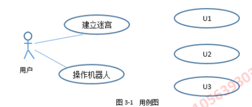

**Mermaid可视化：**
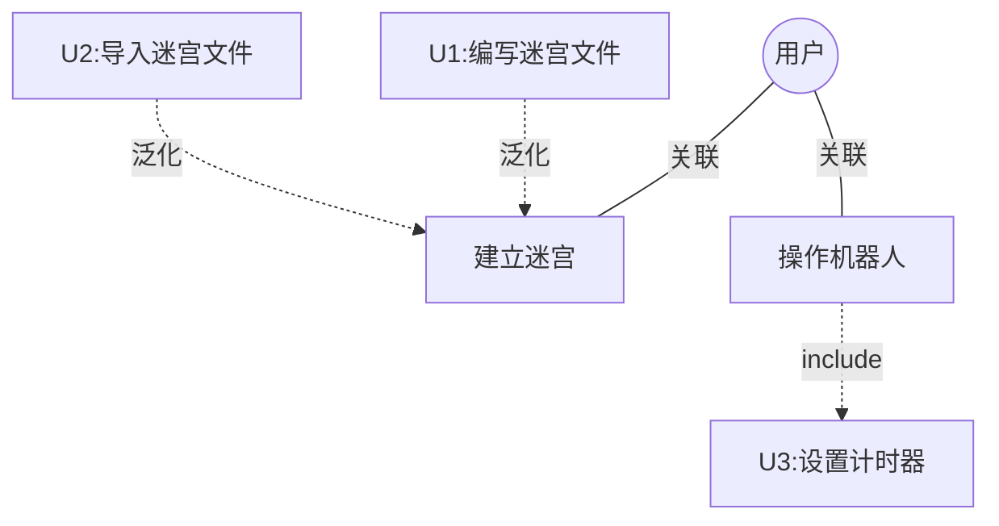

**问题1（3分）：根据说明中的描述，给出用例U1~U3**

**解题思路：**
- 从需求描述中找"建立迷宫"相关的功能
- 从需求描述中找"操作机器人"相关的功能
- 看哪些是用户主动触发的功能

**标准答案：**
- **U1：编写迷宫文件**
- **U2：导入迷宫文件**
- **U3：设置计时器**

**问题2（4分）：用例U1~U3分别与哪个用例之间有关系，是何种关系？**

**解题思路：**
- U1、U2都是建立迷宫的具体方式 → 泛化关系
- U3是操作机器人必须要做的 → 包含关系

**标准答案：**
- **U1、U2与"建立迷宫"用例是泛化关系（Generalization）**
  - 说明：编写迷宫文件和导入迷宫文件都是建立迷宫的特殊方式
  - 箭头方向：U1→建立迷宫，U2→建立迷宫（空心三角箭头）
  
- **U3与"操作机器人"用例是包含关系（Include）**
  - 说明：操作机器人必然包含设置计时器这个步骤
  - 箭头方向：操作机器人→U3（虚线箭头，标注«include»）

**关系辨析重点：**
- 泛化：子用例是父用例的特殊形式（is-a）
- 包含：基础用例必然执行被包含用例（must have）
- 扩展：可选的功能扩展（may have）

### 二、类图（Class Diagram）

#### 1. 基本概念
类图描述系统中的类及其之间的关系。

#### 2. 类的表示
```
┌─────────────────┐
│   类名          │
├─────────────────┤
│   - 属性1       │
│   - 属性2       │
├─────────────────┤
│   + 方法1()     │
│   + 方法2()     │
└─────────────────┘
```

#### 3. 类之间的关系

##### （1）泛化关系（继承）Generalization
- **符号**：实线+空心三角箭头
- **方向**：子类 → 父类
- **含义**：is-a关系
- **例子**：小精灵 → 机器人

##### （2）实现关系（Realization）
- **符号**：虚线+空心三角箭头
- **方向**：实现类 → 接口
- **含义**：implements关系

##### （3）关联关系（Association）
- **符号**：实线，可带箭头
- **含义**：一个类的对象与另一个类的对象有联系
- **多重性**：1, 0..1, 1..*, 0..*, n..m

##### （4）聚合关系（Aggregation）
- **符号**：实线+空心菱形
- **方向**：菱形在整体端
- **含义**：has-a关系，整体与部分可分离
- **例子**：学校 ◇—— 教师

#####（5）组合关系（Composition）
- **符号**：实线+实心菱形
- **方向**：菱形在整体端
- **含义**：contains-a关系，整体与部分共存亡
- **例子**：人 ◆—— 心脏

##### （6）依赖关系（Dependency）
- **符号**：虚线+箭头
- **含义**：一个类使用另一个类
- **例子**：方法参数、局部变量

#### 4. 典型例题答案

**图3-2 类图：**

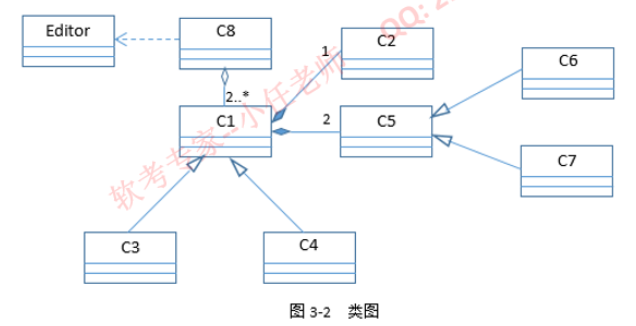

**Mermaid类图可视化：**
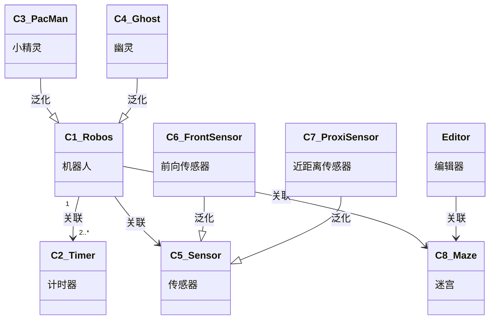

**问题3（8分）：根据说明中的描述，给出图3-2中C1~C8所对应的类名**

**解题思路：**
1. **找核心类**：从需求中找最重要的对象 → 机器人
2. **找继承关系**：看哪些是机器人的子类 → 小精灵、幽灵
3. **找关联对象**：机器人使用什么 → 传感器、计时器、迷宫
4. **找细分类**：传感器有哪些类型 → 前向、近距离

**标准答案：**
- **C1：机器人（Robos）** ⭐核心类
  - 理由：系统的主要对象，有两种类型（小精灵、幽灵）
  
- **C2：计时器（Timer）**
  - 理由：需求中提到"每个机器人都设置有一个计时器"
  - 关联关系：一个机器人有2个或多个计时器（1对2..*）
  
- **C3：小精灵（PacMan）** ⭐可与C4互换
- **C4：幽灵（Ghost）** ⭐可与C4互换
  - 理由：两种机器人类型，继承自机器人类
  
- **C5：传感器（Sensor）**
  - 理由：机器人上有传感器，且有两种类型
  
- **C6：前向传感器（FrontSensor）** ⭐可与C7互换
- **C7：近距离传感器（ProxiSensor）** ⭐可与C7互换
  - 理由：需求中明确提到这两种传感器
  
- **C8：迷宫（Maze）**
  - 理由：机器人在迷宫中游走，编辑器用于创建迷宫

**识别技巧：**
- 从需求描述中提取名词作为候选类
- 分析"is-a"关系确定继承
- 分析"has-a"关系确定关联
- 注意多重性标注（1, 2..*, 0..1等）

### 三、顺序图（Sequence Diagram）

#### 1. 基本概念
顺序图描述对象之间的动态交互，强调消息的时间顺序。

#### 2. 基本元素
- **对象**：矩形框，格式为"对象名:类名"
- **生命线**：从对象向下的虚线
- **激活**：生命线上的窄长矩形，表示对象处于活动状态
- **消息**：对象之间的箭头
  - 同步消息：实线+实心箭头
  - 异步消息：实线+箭头
  - 返回消息：虚线+箭头
  - 自调用：对象调用自己的方法

---

## 第4题 状态图绘制（10分）⭐⭐⭐

### 核心知识点

#### 1. 基本概念
状态图描述对象在其生命周期内响应事件而经历的状态序列。

#### 2. 基本元素
- **状态**：圆角矩形，包含状态名
- **初始状态**：实心黑圆点 ●
- **终止状态**：双圆圈 ⊙
- **转换**：箭头，标注"事件[条件]/动作"
- **判断**：菱形（决策点）

#### 3. 状态的表示
```
┌─────────────┐
│  状态名      │
├─────────────┤
│ entry/进入动作│
│ do/活动      │
│ exit/退出动作│
└─────────────┘
```

#### 4. 典型例题：请假流程状态图

**题目：**
用状态图描述一个请假流程：
- 少于等于3天的请假申请，辅导员审批就可以了
- 超过3天的请假还需系主任审批

**参考状态图：**

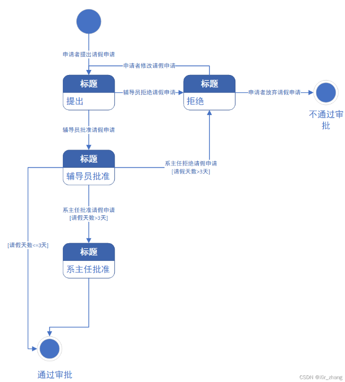

**Mermaid状态图可视化：**
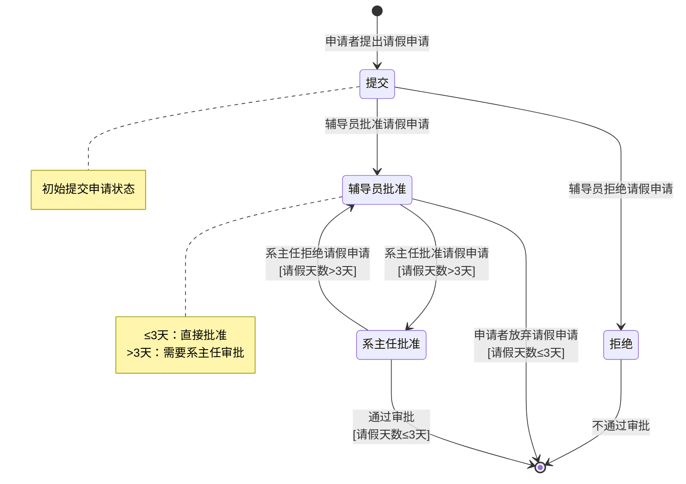

**状态图绘制的关键步骤：**

1. **确定所有状态（圆角矩形）**
   - 提交（初始提交申请）
   - 拒绝（被拒绝）
   - 辅导员批准（等待或已批准）
   - 系主任批准（等待或已批准）

2. **确定初始和终止状态**
   - 初始状态：●（实心黑圆点）
   - 终止状态：⊙（双圆圈，包括"通过审批"和"不通过审批"）

3. **标注转换条件和事件**
   - 格式：**事件[条件]/动作**
   - 例如：申请者提出请假申请
   - 例如：系主任批准请假申请[请假天数>3天]

4. **处理分支判断**
   - ≤3天：辅导员审批后直接结束
   - >3天：需要系主任继续审批

**绘图要点：**
- 状态用圆角矩形，内部可分为状态名和活动
- 转换用箭头，箭头上标注触发事件和条件
- 条件用方括号[]表示
- 注意箭头的方向和标注的完整性

### 答题技巧
1. 先列出所有状态
2. 画出初始状态和终止状态
3. 分析状态转换的触发事件和条件
4. 注意判断条件的标注
5. 检查是否有遗漏的转换路径

### 常见场景
- 订单状态：待付款、已付款、已发货、已签收、已取消
- 用户状态：注册、激活、在线、离线、注销
- 任务状态：创建、进行中、暂停、完成、取消

---

## 第5题 项目管理-关键路径法（10分）⭐⭐⭐

### 核心知识点

#### 1. 基本概念
- **关键路径**：项目中耗时最长的路径，决定了项目的最短完成时间
- **关键活动**：位于关键路径上的活动，任何延迟都会导致整个项目延期
- **时间松弛**：非关键活动可以延迟的最大时间，而不影响项目总工期

#### 2. 重要术语
- **ES (Earliest Start)**：最早开始时间
- **EF (Earliest Finish)**：最早完成时间 = ES + 活动持续时间
- **LS (Latest Start)**：最晚开始时间
- **LF (Latest Finish)**：最晚完成时间 = LS + 活动持续时间
- **TF (Total Float)**：总时差 = LS - ES = LF - EF
- **FF (Free Float)**：自由时差

#### 3. 计算步骤

##### 第一步：正向计算（求ES和EF）
从起点开始，计算每个活动的最早开始和最早完成时间
- 起点活动：ES = 0
- 其他活动：ES = max(所有前置活动的EF)
- EF = ES + 持续时间

##### 第二步：反向计算（求LS和LF）
从终点开始，计算每个活动的最晚开始和最晚完成时间
- 终点活动：LF = EF
- 其他活动：LF = min(所有后续活动的LS)
- LS = LF - 持续时间

##### 第三步：确定关键路径
- 计算时差：TF = LS - ES
- 时差为0的活动是关键活动
- 连接所有关键活动形成关键路径

#### 4. 典型例题

假设项目活动如下：

| 活动 | 前置活动 | 持续时间(天) |
|------|----------|--------------|
| A | - | 3 |
| B | - | 2 |
| C | A | 4 |
| D | B | 5 |
| E | C, D | 3 |
| F | D | 2 |
| G | E, F | 4 |

**问题1：项目最少需要多久完成？**

**解答步骤：**

1. **正向计算：**
```
A: ES=0, EF=0+3=3
B: ES=0, EF=0+2=2
C: ES=3, EF=3+4=7
D: ES=2, EF=2+5=7
E: ES=max(7,7)=7, EF=7+3=10
F: ES=7, EF=7+2=9
G: ES=max(10,9)=10, EF=10+4=14
```

2. **反向计算：**
```
G: LF=14, LS=14-4=10
E: LF=10, LS=10-3=7
F: LF=10, LS=10-2=8
C: LF=7, LS=7-4=3
D: LF=min(7,8)=7, LS=7-5=2
A: LF=3, LS=3-3=0
B: LF=2, LS=2-2=0
```

3. **计算时差：**
```
A: TF=0-0=0 ✓关键活动
B: TF=2-0=2
C: TF=3-3=0 ✓关键活动
D: TF=2-2=0 ✓关键活动
E: TF=7-7=0 ✓关键活动
F: TF=8-7=1
G: TF=10-10=0 ✓关键活动
```

**答案：**
- 项目最少需要**14天**完成
- 关键路径：**A → C → E → G**（或包含D的路径）

**问题2：活动B、F的最早开始时间和最晚开始时间？**
- 活动B：ES=0, LS=2
- 活动F：ES=7, LS=8

### 答题技巧
1. 画出网络图，标注活动和持续时间
2. 按顺序正向计算ES和EF
3. 从终点反向计算LS和LF
4. 找出时差为0的活动作为关键活动
5. 连接关键活动得到关键路径

### 参考资料
详细讲解：https://blog.csdn.net/qq_32088869/article/details/135427150

---

## 第6题 软件测试（15分）⭐⭐

### 核心知识点

#### 1. 测试的基本概念
- **软件测试**：为了发现错误而执行程序的过程
- **测试目的**：发现缺陷、验证功能、评估质量
- **测试原则**：
  - 测试显示缺陷的存在，不能证明没有缺陷
  - 穷尽测试是不可能的
  - 尽早测试
  - 缺陷聚集效应
  - 杀虫剂悖论

#### 2. 测试分类

##### （1）按测试阶段分类
- **单元测试**：测试最小的可测试单元（函数、类）
- **集成测试**：测试模块之间的接口和交互
- **系统测试**：测试整个系统是否满足需求
- **验收测试**：用户验证系统是否可以接受

##### （2）按测试方法分类

**① 黑盒测试（功能测试）**
- 不考虑内部结构，只关注输入输出
- 常用方法：
  - **等价类划分**：将输入域划分为若干等价类
  - **边界值分析**：测试边界值和边界附近的值
  - **判定表**：适用于多条件组合
  - **因果图**：分析输入条件的组合
  - **错误推测**：基于经验猜测可能的错误

**② 白盒测试（结构测试）**
- 考虑程序内部结构和逻辑
- 常用方法：
  - **语句覆盖**：每条语句至少执行一次
  - **判定覆盖（分支覆盖）**：每个判定的真假分支都执行
  - **条件覆盖**：每个条件的真假都至少出现一次
  - **路径覆盖**：所有可能的执行路径都测试

##### （3）按是否运行程序分类
- **静态测试**：不运行程序（代码审查、走查）
- **动态测试**：运行程序进行测试

#### 3. 等价类划分（重点）

##### 基本思想
将所有可能的输入数据划分为若干等价类，从每个等价类中选取代表性数据进行测试。

##### 有效等价类 vs 无效等价类
- **有效等价类**：符合需求的合理输入
- **无效等价类**：不符合需求的不合理输入

##### 划分原则
1. 输入条件是一个范围：一个有效等价类，两个无效等价类
2. 输入条件是一个具体值：一个有效等价类，两个无效等价类
3. 输入条件是一个集合：一个有效等价类，一个无效等价类
4. 输入条件是一个布尔值：一个有效等价类，一个无效等价类

##### 典型例题
**题目：**某程序要求输入年龄，范围是18-60岁，请划分等价类。

**答案：**
| 编号 | 等价类 | 类型 |
|------|--------|------|
| 1 | 18 ≤ 年龄 ≤ 60 | 有效 |
| 2 | 年龄 < 18 | 无效 |
| 3 | 年龄 > 60 | 无效 |
| 4 | 非数字输入 | 无效 |
| 5 | 空输入 | 无效 |

**测试用例：**
- 有效：30（选择中间值）
- 无效：10, 70, "abc", ""

#### 4. 边界值分析（重点）

##### 基本思想
大量错误发生在输入或输出范围的边界上，因此需要重点测试边界值。

##### 选取原则
- 边界值本身
- 边界值的左侧值（边界-1）
- 边界值的右侧值（边界+1）

##### 典型例题
**题目：**输入范围是18-60岁，列出边界值测试用例。

**答案：**
- 17（下边界-1）
- 18（下边界）
- 19（下边界+1）
- 59（上边界-1）
- 60（上边界）
- 61（上边界+1）

#### 5. 判定表（Decision Table）

##### 适用场景
多个输入条件的各种组合导致不同的输出。

##### 组成部分
- **条件桩**：列出所有输入条件
- **动作桩**：列出所有可能的动作
- **条件项**：每个条件的取值（T/F或Y/N）
- **动作项**：对应条件下应执行的动作（X表示执行）

##### 典型例题
**题目：**某系统根据用户等级和订单金额决定折扣：
- 会员且订单≥100元：8折
- 会员且订单<100元：9折
- 非会员且订单≥100元：9.5折
- 非会员且订单<100元：无折扣

**判定表：**
| 条件/动作 | 规则1 | 规则2 | 规则3 | 规则4 |
|----------|-------|-------|-------|-------|
| 是会员 | Y | Y | N | N |
| 金额≥100 | Y | N | Y | N |
| 8折 | X | | | |
| 9折 | | X | | |
| 9.5折 | | | X | |
| 无折扣 | | | | X |

#### 6. 白盒测试覆盖率（重点）

##### 覆盖率从低到高：
1. **语句覆盖**：最弱（覆盖度最低）
2. **判定覆盖（分支覆盖）**
3. **条件覆盖**
4. **判定/条件覆盖**
5. **条件组合覆盖**
6. **路径覆盖**：最强但不可行（覆盖度最高）

##### 典型例题（题39 - 重要考题）

**题目描述：**
采用白盒测试法对题39图所对应的程序流程图进行测试。要求从题39表的候选答案中分别找出满足**分支覆盖**、**条件覆盖**、**条件组合覆盖**和**路径覆盖** 4种覆盖标准的最少测试用例。例如，根据语句覆盖的标准选择①（最少测试用例）。

**题39图 - 程序流程图：**


**题39表 - 测试用例候选答案：**

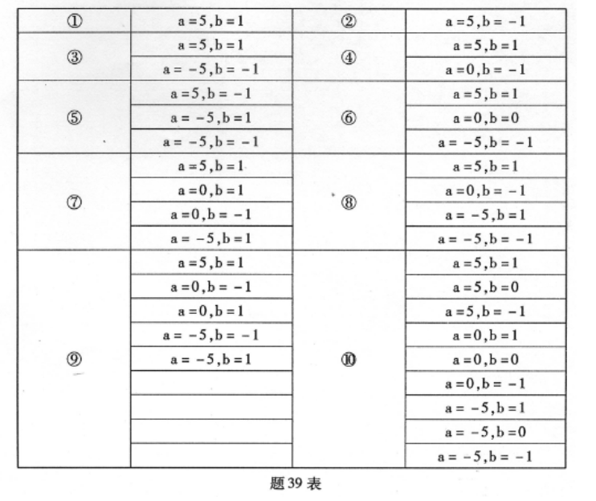

**Mermaid流程图可视化：**
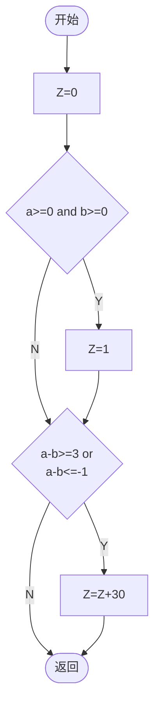

**关键判定分析：**
- **判定1**：`a>=0 and b>=0` （由两个条件组成）
  - 条件A：`a>=0`
  - 条件B：`b>=0`
  - 判定1为真：A真 AND B真
  - 判定1为假：A假 OR B假

- **判定2**：`(a-b)>=3 or (a-b)<=-1`（由两个条件组成）
  - 条件C：`(a-b)>=3`
  - 条件D：`(a-b)<=-1`
  - 判定2为真：C真 OR D真
  - 判定2为假：C假 AND D假

**标准答案图：**

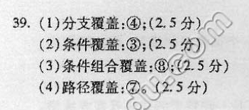

**标准答案详解：**

**39. (1) 分支覆盖：④；(2.5分)**
- **目标**：每个判定的真假分支都至少执行一次
- **选择④**包含：
  ```
  a=0, b=-1  → 判定1为假（a>=0真，b>=0假）
  a=5, b=1   → 判定1为真，判定2为假
  ```
- 覆盖了判定1的真假、判定2的真假

**(2) 条件覆盖：⑧；(2.5分)**
- **目标**：每个条件的真假值都至少出现一次
- **选择⑧**包含：
  ```
  a=0, b=-1  → a>=0(真), b>=0(假), (a-b)>=3(假), (a-b)<=-1(真)
  a=-5, b=1  → a>=0(假), b>=0(真), (a-b)>=3(假), (a-b)<=-1(真)
  a=-5, b=-1 → a>=0(假), b>=0(假), (a-b)>=3(假), (a-b)<=-1(真)
  ```
- 所有条件的真假都出现了

**(3) 条件组合覆盖：⑧；(2.5分)**
- **目标**：所有条件的所有可能组合都至少出现一次
- **选择⑧**覆盖了多种条件组合

**(4) 路径覆盖：⑦；(2.5分)**
- **目标**：所有可能的执行路径都测试到
- **可能路径**：
  - 路径1：Z=0 → 判定1(N) → 判定2(N) → 返回
  - 路径2：Z=0 → 判定1(N) → 判定2(Y) → Z=Z+30 → 返回
  - 路径3：Z=0 → 判定1(Y) → Z=1 → 判定2(N) → 返回
  - 路径4：Z=0 → 判定1(Y) → Z=1 → 判定2(Y) → Z=Z+30 → 返回
- **选择⑦**包含：
  ```
  a=5, b=1    → 路径3
  a=0, b=1    → 路径1
  a=0, b=-1   → 路径2
  a=-5, b=1   → 路径2
  ```

**记忆技巧：**
- **语句覆盖**：最简单，每行代码走一遍
- **分支覆盖**：每个if/else都要走
- **条件覆盖**：每个条件的真假都要测
- **条件组合覆盖**：所有条件组合都要测
- **路径覆盖**：所有路径都要走

**答题策略：**
1. 先画出控制流图，标注所有判定和路径
2. 列出所有条件和可能的组合
3. 根据覆盖标准选择最少的测试用例
4. 验证是否满足覆盖要求

#### 7. 集成测试策略

##### （1）非增量式集成（Big Bang）
- 一次性组装所有模块
- 优点：简单
- 缺点：难以定位错误

##### （2）增量式集成
**① 自顶向下集成**
- 从主控模块开始，逐层向下
- 需要使用**桩模块（Stub）**代替下层未完成的模块
- 优点：尽早验证主要控制逻辑
- 缺点：底层模块测试较晚

**② 自底向上集成**
- 从底层模块开始，逐层向上
- 需要使用**驱动模块（Driver）**调用被测模块
- 优点：底层模块充分测试
- 缺点：主控逻辑验证较晚

**③ 三明治集成（混合）**
- 结合自顶向下和自底向上
- 同时测试顶层和底层，最后测试中间层

#### 8. 测试用例设计

##### 测试用例要素
- **用例编号**：唯一标识
- **测试项**：测试的功能点
- **输入数据**：测试输入
- **操作步骤**：执行步骤
- **预期结果**：期望的输出
- **实际结果**：实际输出
- **测试状态**：通过/失败

##### 设计原则
1. 覆盖所有需求
2. 包含正常和异常情况
3. 测试用例独立
4. 可重复执行
5. 简洁明确

### 答题技巧
1. **等价类划分题**：分清有效和无效，不要遗漏
2. **边界值分析题**：记住边界、边界-1、边界+1
3. **判定表题**：列出所有条件组合，标注对应动作
4. **覆盖率计算题**：画出控制流图，标注路径
5. **选择题**：理解概念，注意关键词

### 常考知识点
- 等价类划分和边界值分析的应用
- 判定表的绘制
- 白盒测试覆盖率的计算
- 集成测试策略的选择
- 测试用例的设计

---

## 📸 图片配合学习指南

### 如何使用图片资料

本复习资料中的所有题目都配有原始图片，建议学习时：

**第1题 数据流图：**
- 查看 **image_6.png**（上下文图）和 **image_5.png**（0层图）
- 对照图片理解E1-E4、D1-D4、P1-P5的位置和关系
- 查看 **image_4.png** 核对答案

**第3题 UML用例图和类图：**
- 查看 **image_2.png**（用例图）理解U1-U3的位置和关系
- 查看 **image_1.png**（类图）理解C1-C8的关系和箭头方向
- 重点关注泛化、关联、多重性的表示

**第4题 状态图：**
- 查看 **image_7.png**（请假流程状态图）
- 注意状态、转换、条件的标注方式
- 学习如何处理分支判断

**第6题 白盒测试：**
- 查看 **image_10.png**（程序流程图）理解判定逻辑
- 查看 **image_9.png**（测试用例表）了解候选答案
- 查看 **image_8.png** 核对标准答案

### 学习建议
1. **先看题目**：阅读本文档中的题目描述
2. **自己做题**：尝试独立解答，画出图形
3. **对照图片**：打开对应图片，检查自己的答案
4. **理解差异**：找出错误，理解正确答案的逻辑
5. **反复练习**：多画几遍，熟能生巧

---

## 🎯 复习重点总结

### 第一优先级（必须掌握）
1. ✅ 数据流图：外部实体、数据存储、加工的识别
2. ✅ 数据流图三大错误：黑洞、奇迹、灰洞
3. ✅ 用例图：include、extend、泛化关系
4. ✅ 类图：泛化、聚合、组合、关联、依赖关系
5. ✅ 状态图：状态、转换、判断条件的绘制
6. ✅ 关键路径：ES、LS、EF、LF的计算方法
7. ✅ 等价类划分和边界值分析

### 第二优先级（重要）
1. 可行性分析四个方面的内容
2. 顺序图的绘制
3. 白盒测试覆盖率
4. 集成测试策略
5. 判定表的应用

### 第三优先级（了解）
1. 软件测试的基本概念和原则
2. 测试用例的设计
3. 其他UML图

---

## 📚 复习建议

### 时间分配（考前一周）
- **第1-2天**：数据流图 + 用例图/类图练习
- **第3-4天**：状态图 + 关键路径法练习
- **第5天**：软件测试 + 可行性分析
- **第6天**：综合练习，做老师给的例题
- **第7天**：查漏补缺，重点突破

### 学习方法
1. **理解概念**：不要死记硬背，理解为主
2. **多画图**：UML图一定要动手画
3. **做例题**：把老师给的题目反复做
4. **总结规律**：找出答题的套路和技巧
5. **模拟考试**：限时完成整套题目

### 考场策略
1. **先易后难**：可行性分析等送分题先做
2. **时间分配**：按分值分配时间，不要在难题上纠结太久
3. **审题仔细**：题目描述很长，关键信息要标注
4. **检查答案**：做完后检查，特别是图的箭头方向

---

## 🔗 参考资料

### 关键路径法详解
https://blog.csdn.net/qq_32088869/article/details/135427150

### UML图详解和注意点
https://blog.csdn.net/qq_44185103/article/details/130082127

https://blog.csdn.net/ChengquanLam/article/details/73161038

### 老师复习资料
请重点复习老师发的"复习参考.docx"中的例题，吃透解题思路。

### 配套图片资料
本复习资料配套的图片已提取至：
`C:\Users\26214\Desktop\OPreview\软件工程_提取内容\复习参考_图片\`

包含的图片：
- **image_1.png**: 类图（图3-2）- 吃金币游戏类图
- **image_2.png**: 用例图（图3-1）- 吃金币游戏用例图
- **image_3.png**: 数据流图问题4答案
- **image_4.png**: 数据流图问题1-3答案
- **image_5.png**: 0层数据流图（图1-2）- 智慧农业平台
- **image_6.png**: 上下文数据流图（图1-1）- 智慧农业平台
- **image_7.png**: 请假流程状态图示例
- **image_8.png**: 白盒测试题39答案
- **image_9.png**: 白盒测试题39测试用例表
- **image_10.png**: 白盒测试题39流程图

---

## 💪 最后叮嘱

1. **不要慌**：题目虽然长，但只要掌握方法，90分以上没问题
2. **多练习**：特别是画图题，熟能生巧
3. **记口诀**：关键知识点编成口诀记忆
4. **有信心**：老师说了，复习资料已经给的很到位了

**祝你考试顺利，轻松90+！** 🎉

---

*最后更新：2026年1月5日*
*考试时间：2026年1月6日*

