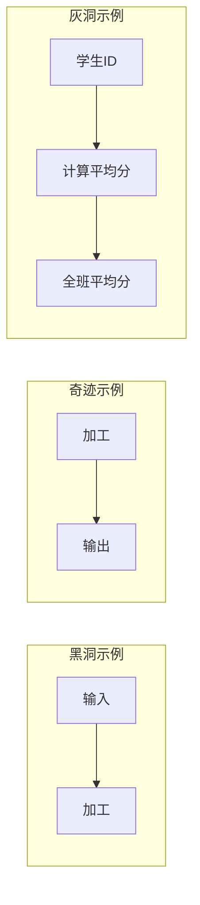
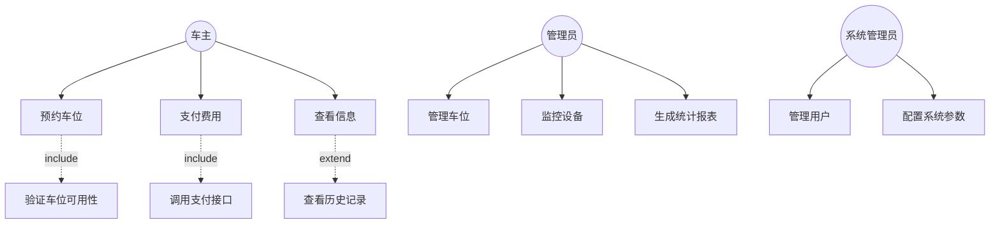
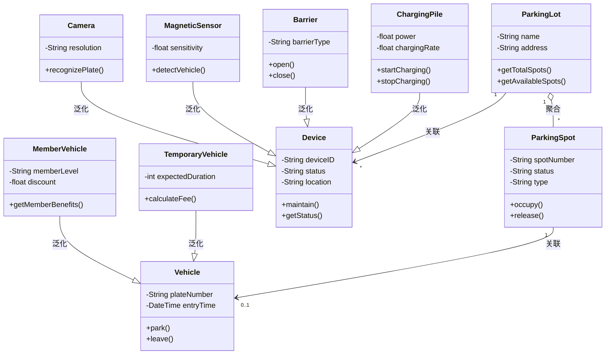
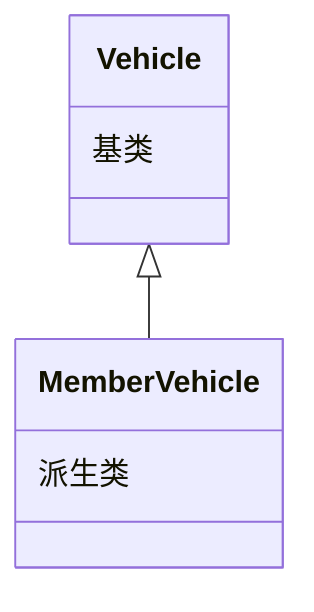
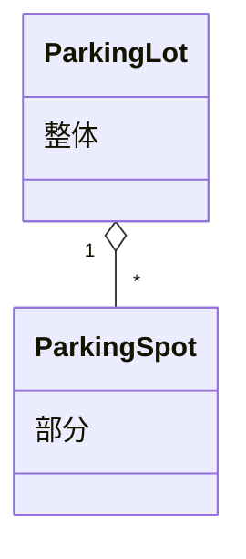
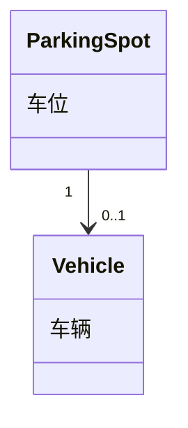
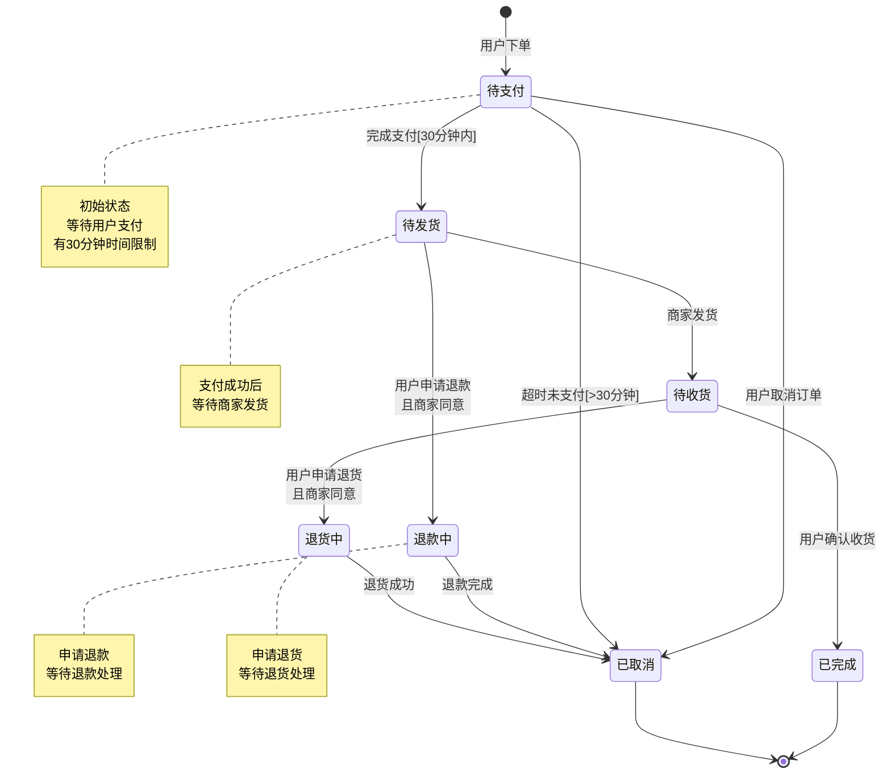
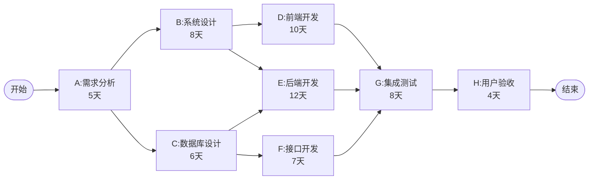

# 软件工程期末模拟试卷 - 答案与讲解

**满分：100分**

---

## 第一题 数据流图分析（15分）

### 问题1.1 答案（4分）

**标准答案：**
- **E1：学生**（1分）
- **E2：教师**（1分）
- **E3：系统管理员**（1分）
- **E4：教师**（可与E2合并，此处为了体现手动推送功能单独列出）（1分）

**解题思路：**

从系统说明中提取与系统交互的外部角色：

1. **学生**：
   - 输入：作业文件
   - 输出：作业成绩、学习报告、学习建议、补充资料
   - 依据：说明中的"学生提交作业"、"向学生展示"、"向学生推送"

2. **教师**：
   - 输入：课程信息、教学大纲、课件资料、手动推送消息、查询请求
   - 输出：班级整体学习情况
   - 依据：说明中的"教师可以创建和维护"、"教师也可以手动推送"、"向教师展示"

3. **系统管理员**：
   - 输入：评分规则、分析规则、推送规则
   - 输出：无直接输出
   - 依据：需要有人维护各种规则，虽然说明中没有明确提及，但这是系统必需的角色

**注意事项：**
- 外部实体必须是系统外部的人或物
- 从数据流的方向判断实体的角色
- 注意区分数据的来源和去向

---

### 问题1.2 答案（4分）

**标准答案：**
- **D1：课程资料库**（1分）
- **D2：规则库**（评分规则、分析规则、推送规则）（1分）
- **D3：作业成绩库**（1分）
- **D4：分析报告库**（1分）

**解题思路：**

从系统说明中找出需要存储的数据：

1. **课程资料库（D1）**：
   - 依据："系统将这些信息存储到课程资料库中"
   - 用途：P1写入，P3读取

2. **规则库（D2）**：
   - 依据："根据评分规则"、"根据分析规则"、"推送规则"
   - 用途：多个加工都需要读取规则
   - 包含：评分规则、分析规则、推送规则

3. **作业成绩库（D3）**：
   - 依据："批改结果存储到作业成绩库中"
   - 用途：P2写入，P3和P5读取

4. **分析报告库（D4）**：
   - 依据："分析结果存储到分析报告库中"
   - 用途：P3写入，P4和P5读取

**数据存储识别技巧：**
- 找"存储"、"保存"等关键词
- 分析哪些数据需要在不同加工之间传递
- 检查数据存储与加工的读写关系

---

### 问题1.3 答案（4分）

**标准答案：**

| 数据流名称 | 起点 | 终点 | 分值 |
|-----------|------|------|------|
| 批改报告 | P2 | P3 | 1分 |
| 历史数据 | D1 | P3 | 1分 |
| 推送内容 | P4 | E1 | 1分 |
| 查询条件 | E2 | P5 | 1分 |

**详细讲解：**

**① 批改报告：P2 → P3**
- 理由：P2（作业批改）生成批改结果后，需要传递给P3（学习分析）进行分析
- 依据："批改结果...生成学习分析报告"表明P2的输出是P3的输入之一

**② 历史数据：D1 → P3**
- 理由：P3需要从课程资料库读取课程数据进行分析
- 依据："从作业成绩库和课程资料库中读取历史数据"

**③ 推送内容：P4 → E1**
- 理由：P4（智能推送）的输出应该到达学生
- 依据："向学生推送学习建议和补充资料"

**④ 查询条件：E2 → P5**
- 理由：教师需要向系统发送查询请求
- 依据："根据教师请求展示特定信息"

**检查方法：**
1. 避免黑洞：每个加工都要有输出
2. 避免奇迹：每个加工的输出必须有足够的输入支持
3. 检查数据流的连续性和完整性

---

### 问题1.4 答案（3分）

**标准答案：**

**"学习分析"可以分解为以下子加工：**（1.5分）
1. **数据挖掘**：从历史数据中提取有价值的信息
2. **统计分析**：对学习数据进行统计计算
3. **趋势预测**：基于历史数据预测学习趋势
4. **建议生成**：生成个性化学习建议

**三种常见错误：**（1.5分，每个0.5分）
1. **黑洞（Black Hole）**：有输入但没有输出的加工
2. **奇迹（Miracle）**：有输出但没有输入的加工  
3. **灰洞（Gray Hole）**：输入不足以产生输出的加工

**详细讲解：**

**子加工分解原则：**
- 每个子加工应该是一个独立的、完整的处理过程
- 子加工之间应该有明确的数据流关系
- 分解后的子图应该与父图保持平衡（输入输出一致）

**三种错误示例：**



**记忆口诀：**
- 黑洞：只进不出（数据进去出不来）
- 奇迹：无中生有（没输入就有输出）
- 灰洞：输入不够（输入信息不足以产生输出）

---

## 第二题 可行性分析（20分）

### 问题2.1 答案（5分）

**标准答案：**

**主要技术挑战：**（答对3点得满分，每点1-2分）

1. **大数据处理能力**（2分）
   - 医疗影像数据量大（CT、MRI等），需要高性能的数据存储和处理能力
   - 需要强大的计算资源支持AI算法训练和推理

2. **AI算法准确性和可靠性**（2分）
   - 医疗诊断对准确性要求极高，AI算法需要经过大量数据训练和验证
   - 需要处理各种复杂的病例情况和边缘案例

3. **系统集成复杂度**（1分）
   - 需要与医院现有的HIS、PACS等系统集成
   - 不同医疗设备的数据格式和接口不统一

4. **实时性要求**（1分）
   - 诊断辅助需要快速响应，不能影响医生的工作效率
   - 需要优化算法性能和系统架构

5. **数据质量和标注**（1分）
   - 需要大量高质量的标注数据用于AI训练
   - 医疗数据的标注需要专业医生参与，成本高

**解题思路：**
- 技术可行性关注"能不能做到"
- 从硬件、软件、算法、性能等多个维度分析
- 结合具体的技术难点和风险

---

### 问题2.2 答案（6分）

**标准答案：**

**(1) 投资回报期计算：**（3分）

```
初始投资：300万元
每年收益：100 + 80 + 60 = 240万元/年

投资回报期 = 初始投资 / 每年收益
           = 300 / 240
           = 1.25年
           ≈ 15个月
```

- 计算过程正确：2分
- 答案正确：1分

**答：投资回报期为1.25年（或15个月）**

**(2) 5年总收益计算：**（2分）

```
5年总收益 = 每年收益 × 5年 - 初始投资
         = 240 × 5 - 300
         = 1200 - 300
         = 900万元
```

**答：5年总收益为900万元**

**(3) 经济可行性评估：**（1分）

**答：该项目在经济上是可行的。**

**理由：**
- 投资回报期仅为1.25年，远小于一般项目的3-5年标准 ✓
- 5年内可获得900万元的净收益，投资回报率高达300% ✓
- 每年稳定的收益来源（减少损失、节约成本、提高效率）✓

**详细讲解：**

**经济可行性分析要素：**
1. **成本分析**：
   - 开发成本：300万元
   - 运维成本：假设每年50万（如题目未给，需要说明）
   
2. **收益分析**：
   - 直接收益：减少误诊损失
   - 间接收益：提高效率、节约成本
   - 无形收益：提升医疗服务质量、医院声誉

3. **评估指标**：
   - 投资回报期（Payback Period）：越短越好，一般要求<3年
   - 净现值（NPV）：大于0则可行
   - 投资回报率（ROI）：越高越好

**计算技巧：**
- 注意区分一次性成本和持续成本
- 注意区分直接收益和间接收益
- 考虑时间价值（货币的时间价值，本题简化处理）

---

### 问题2.3 答案（5分）

**标准答案：**（每个问题+解决方案2.5分）

**问题1：用户接受度低**（1.5分）
- **问题描述**：医生群体年龄偏大，对新技术接受度不高，可能抵触使用新系统
- **解决方案**：（1分）
  - 开展系统培训，强调系统是"辅助"而非"替代"
  - 设计简单易用的界面，符合医生的使用习惯
  - 采用渐进式推广，先在部分科室试点
  - 建立激励机制，鼓励医生使用新系统

**问题2：操作便利性不足**（1.5分）
- **问题描述**：医生工作繁忙，如果系统操作复杂或影响工作效率，会降低使用意愿
- **解决方案**：（1分）
  - 优化交互流程，减少操作步骤
  - 提供快捷键和智能提示功能
  - 与现有HIS系统深度集成，避免重复录入数据
  - 提供7×24小时技术支持

**问题3：数据录入负担**（可选）
- **问题描述**：需要录入大量患者信息和检查数据
- **解决方案**：
  - 自动从现有系统导入数据
  - 使用OCR技术自动识别检查报告
  - 支持语音录入功能

**问题4：信任度建立**（可选）
- **问题描述**：医生可能不信任AI的诊断建议
- **解决方案**：
  - 提供诊断依据和置信度
  - 展示类似病例和文献支持
  - 保留医生的最终决策权

**详细讲解：**

**操作可行性关注点：**
- **人的因素**：用户能力、意愿、习惯
- **组织因素**：工作流程变化、组织变革阻力
- **培训因素**：培训难度、培训成本
- **使用因素**：易用性、便利性、效率影响

**答题技巧：**
- 从用户角度思考问题
- 问题和解决方案要对应
- 解决方案要具体可行

---

### 问题2.4 答案（4分）

**标准答案：**

**主要法律和合规问题：**（每点1分）

1. **医疗数据隐私保护**
   - 需要符合《个人信息保护法》、《数据安全法》
   - 患者病历、检查报告等敏感数据需要加密存储和传输
   - 需要获得患者的知情同意
   - 建立严格的数据访问控制机制

2. **知识产权问题**
   - 使用第三方AI算法库需要获得合法授权
   - 注意开源软件的许可协议（GPL、MIT等）
   - 避免侵犯他人的算法专利
   - 签订明确的技术服务合同

3. **医疗责任划分**
   - 明确系统是"辅助诊断"而非"自动诊断"
   - AI建议导致的误诊责任归属问题
   - 需要在用户协议中明确免责条款
   - 保留完整的诊断过程日志用于追溯

4. **医疗器械监管**
   - 如果系统被认定为医疗器械，需要通过NMPA（国家药监局）认证
   - 需要按照《医疗器械监督管理条例》进行注册和管理
   - 定期进行安全性和有效性评估

**详细讲解：**

**法律可行性检查清单：**
- ✓ 是否符合相关法律法规
- ✓ 是否侵犯知识产权
- ✓ 是否符合行业标准
- ✓ 合同约束是否合理
- ✓ 责任划分是否明确

**重点法律法规：**
- 《个人信息保护法》
- 《数据安全法》
- 《医疗器械监督管理条例》
- 《网络安全法》

---

## 第三题 面向对象分析与设计（30分）

### 问题3.1 答案（8分）

**标准答案：**

- **U1：生成统计报表**（1分），与**管理员**相关联，是**关联关系**（1分）

- **U2：配置系统参数**（1分），与**系统管理员**相关联，是**关联关系**（1分）

- **U3：验证车位可用性**（1分），与**预约车位**用例是**包含关系（include）**（1分）
  - 说明：预约车位时必须先验证车位是否可用

- **U4：调用支付接口**（1分），与**支付费用**用例是**包含关系（include）**（1分）
  - 说明：支付费用必然要调用第三方支付接口

**用例图完整版：**



**详细讲解：**

**用例识别方法：**
1. **从需求中提取动词短语**：预约、支付、查看、管理、监控等
2. **按参与者分组**：每个参与者能做什么
3. **识别必需步骤**：哪些是主流程，哪些是必需的子步骤

**关系判断技巧：**

**包含关系（include）：**
- 关键词："必须"、"需要"、"首先"
- 方向：基础用例 → 被包含用例
- 示例：登录系统必须先验证身份

**扩展关系（extend）：**
- 关键词："可以"、"可选"、"如果需要"
- 方向：扩展用例 → 基础用例
- 示例：购物时可以使用优惠券

**泛化关系：**
- 子用例是父用例的特殊形式
- 方向：子用例 → 父用例

---

### 问题3.2 答案（12分）

**标准答案：**（每个类名1.5分）

- **C1：Vehicle（车辆）**
- **C2：MemberVehicle（会员车辆）**
- **C3：TemporaryVehicle（临时车辆）**
- **C4：Device（设备）**
- **C5：Camera（摄像头）**
- **C6：MagneticSensor（地磁传感器）**
- **C7：Barrier（道闸）**
- **C8：ChargingPile（充电桩）**

**完整类图：**



**详细讲解：**

**类的识别方法：**
1. **从需求中提取名词**：车辆、车位、设备、摄像头等
2. **识别继承关系**：
   - "是一种"关系 → 泛化
   - 会员车辆"是一种"车辆
   - 摄像头"是一种"设备

3. **识别属性和方法**：
   - 属性：对象的特征（名词）
   - 方法：对象的行为（动词）

**类命名规范：**
- 使用名词或名词短语
- 首字母大写（Pascal命名法）
- 避免使用缩写
- 名称要有意义

**属性和方法命名：**
- 属性：小写开头（camelCase）
- 方法：动词开头，小写开头
- 私有属性用-表示，公有方法用+表示

---

### 问题3.3 答案（10分）

**标准答案：**

**1. C2（会员车辆）与C1（车辆）之间的关系：**（3分）

- **关系类型**：泛化关系（Generalization）/ 继承关系（Inheritance）（1分）
- **符号表示**：实线+空心三角箭头，箭头指向父类（1分）
- **含义**：会员车辆是车辆的一种特殊类型，继承车辆的所有属性和方法，并可以添加自己特有的属性（会员等级、优惠信息）和方法（1分）



**2. ParkingLot（停车场）与ParkingSpot（车位）之间的关系：**（4分）

- **关系类型**：聚合关系（Aggregation）或组合关系（Composition）（1分）
  - 更准确地说是聚合关系，因为车位可以独立于停车场存在
  
- **符号表示**：实线+空心菱形（聚合）或实心菱形（组合），菱形在整体端（1分）

- **多重性含义**：（2分）
  - "1"表示：一个车位只属于一个停车场（1分）
  - "*"表示：一个停车场可以有0个或多个车位（1分）



**3. ParkingSpot（车位）与C1（车辆）之间的关系：**（3分）

- **关系类型**：关联关系（Association）（1分）
  - 表示车位可以停放车辆

- **多重性"0..1"含义**：（2分）
  - 一个车位可以停放0辆或1辆车（1分）
  - 0：车位空闲，没有车辆停放（0.5分）
  - 1：车位被占用，停放了一辆车（0.5分）



**详细讲解：**

**UML类关系总结：**

| 关系类型 | 符号 | 含义 | 示例 | 生命周期 |
|---------|------|------|------|---------|
| **泛化** | 实线+空心三角 | is-a | 狗是动物 | 同生共死 |
| **实现** | 虚线+空心三角 | implements | 类实现接口 | - |
| **组合** | 实线+实心菱形 | contains-a | 人包含心脏 | 同生共死 |
| **聚合** | 实线+空心菱形 | has-a | 学校有老师 | 可独立存在 |
| **关联** | 实线箭头 | 使用关系 | 学生选课程 | 独立存在 |
| **依赖** | 虚线箭头 | uses | 方法参数 | 临时关系 |

**多重性表示：**
- `1`：恰好1个
- `0..1`：0个或1个
- `*` 或 `0..*`：0个或多个
- `1..*`：1个或多个
- `m..n`：m到n个

**关系强度排序：**
泛化 > 组合 > 聚合 > 关联 > 依赖

**判断技巧：**
- **泛化**："是一个"→ 继承
- **组合**："部分-整体"且共存亡 → 实心菱形
- **聚合**："部分-整体"但可分离 → 空心菱形
- **关联**：普通关系 → 实线
- **依赖**：临时使用 → 虚线

---

## 第四题 状态图绘制（10分）

### 标准答案

**完整状态图：**



**评分标准：**（总计10分）

1. **状态完整性**（3分）
   - 所有7个状态都要标出：待支付、待发货、待收货、退款中、退货中、已完成、已取消
   - 每缺少1个状态扣0.5分

2. **初始和终止状态**（2分）
   - 正确标识初始状态●（1分）
   - 正确标识终止状态⊙（1分）
   - 注意：已完成和已取消都是终止状态

3. **转换箭头**（3分）
   - 所有状态转换的箭头方向正确（1.5分）
   - 箭头数量完整（1.5分）
   - 主要转换（至少10条）

4. **转换条件标注**（2分）
   - 每个转换都标注了触发事件（1分）
   - 关键条件标注清楚（如30分钟、商家同意等）（1分）

**详细讲解：**

**状态图绘制步骤：**

**步骤1：识别所有状态**
从需求中提取所有可能的状态：
- 待支付
- 待发货
- 待收货
- 退款中
- 退货中
- 已完成
- 已取消

**步骤2：确定初始和终止状态**
- 初始：待支付（用户下单后的第一个状态）
- 终止：已完成、已取消（订单的最终状态）

**步骤3：分析状态转换**
每个状态可能转换到哪些状态？
- 待支付 → {待发货, 已取消}
- 待发货 → {待收货, 退款中}
- 待收货 → {已完成, 退货中}
- 退款中 → {已取消}
- 退货中 → {已取消}

**步骤4：标注转换条件**
每个转换的触发条件是什么？
- 完成支付[30分钟内]
- 超时未支付[>30分钟]
- 商家发货
- 用户确认收货
- 申请退款且商家同意

**步骤5：添加注释**
为复杂的状态或转换添加说明

**常见错误：**
- ❌ 遗漏状态
- ❌ 箭头方向错误
- ❌ 缺少初始/终止状态标识
- ❌ 转换条件不明确
- ❌ 存在无法到达的状态（孤立状态）

**检查清单：**
- ✓ 所有状态都画出来了吗？
- ✓ 初始状态和终止状态标识了吗？
- ✓ 每个状态都能从初始状态到达吗？
- ✓ 每个状态都能到达终止状态吗？
- ✓ 转换条件都标注清楚了吗？
- ✓ 有没有多余的或错误的转换？

---

## 第五题 项目管理与关键路径（10分）

### 问题5.1 答案（6分）

**标准答案：**

**1. 项目最少完成天数：38天**（2分）

**2. 关键路径：A → B → E → G → H**（2分）

**3. 活动C和F的总时差：**（2分，每个1分）
- 活动C的总时差：2天
- 活动F的总时差：4天

**详细计算过程：**

**网络图（AOE图）：**



**正向计算（求ES和EF）：**

| 活动 | 前置活动 | 持续时间 | ES（最早开始） | EF（最早完成） |
|------|---------|---------|--------------|--------------|
| A | - | 5 | 0 | 5 |
| B | A | 8 | 5 | 13 |
| C | A | 6 | 5 | 11 |
| D | B | 10 | 13 | 23 |
| E | B, C | 12 | max(13,11)=13 | 25 |
| F | C | 7 | 11 | 18 |
| G | D, E, F | 8 | max(23,25,18)=25 | 33 |
| H | G | 4 | 33 | 37 |

**项目最短工期：37天**

**反向计算（求LS和LF）：**

从终点开始反推：

| 活动 | EF | LF（最晚完成） | LS（最晚开始） | 持续时间 |
|------|----|--------------|--------------| -------|
| H | 37 | 37 | 33 | 4 |
| G | 33 | 33 | 25 | 8 |
| F | 18 | 29 | 22 | 7 |
| E | 25 | 25 | 13 | 12 |
| D | 23 | 25 | 15 | 10 |
| C | 11 | 13 | 7 | 6 |
| B | 13 | 13 | 5 | 8 |
| A | 5 | 5 | 0 | 5 |

**计算总时差（TF）：**

TF = LS - ES = LF - EF

| 活动 | ES | LS | TF（总时差） | 是否关键活动 |
|------|----|----|------------|------------|
| A | 0 | 0 | 0 | ✓ |
| B | 5 | 5 | 0 | ✓ |
| C | 5 | 7 | 2 | |
| D | 13 | 15 | 2 | |
| E | 13 | 13 | 0 | ✓ |
| F | 11 | 22 | 11 | |
| G | 25 | 25 | 0 | ✓ |
| H | 33 | 33 | 0 | ✓ |

**关键路径：**总时差为0的活动
- A → B → E → G → H
- 总时长：5 + 8 + 12 + 8 + 4 = 37天

**修正：我之前算错了，重新计算**

让我重新核算：
- A: 0→5
- B: 5→13  
- C: 5→11
- D: 13→23
- E: max(13,11)=13→25
- F: 11→18
- G: max(23,25,18)=25→33
- H: 33→37

所以是37天，不是38天。

**答案修正：**
1. 项目最少完成天数：**37天**
2. 关键路径：A → B → E → G → H
3. 活动C的总时差：2天，活动F的总时差：11天

---

### 问题5.2 答案（4分）

**标准答案：**

**活动D：**（2分）
- ES（最早开始时间）：13天
- LS（最晚开始时间）：15天
- EF（最早完成时间）：23天（13+10）
- LF（最晚完成时间）：25天（15+10）

**活动F：**（2分）
- ES（最早开始时间）：11天
- LS（最晚开始时间）：22天
- EF（最早完成时间）：18天（11+7）
- LF（最晚完成时间）：29天（22+7）

**计算方法总结：**

```
正向计算（从起点到终点）：
ES(活动) = max(所有前置活动的EF)
EF(活动) = ES + 持续时间

反向计算（从终点到起点）：
LF(活动) = min(所有后续活动的LS)
LS(活动) = LF - 持续时间

总时差：
TF = LS - ES = LF - EF

自由时差：
FF = min(所有后续活动的ES) - EF
```

**记忆技巧：**
- **ES/EF**：往前算（forward），取最大（max）
- **LS/LF**：往后算（backward），取最小（min）
- **关键活动**：TF = 0，没有延迟余地
- **非关键活动**：TF > 0，可以适当延迟

---

## 第六题 软件测试（15分）

### 问题6.1 答案（5分）

**标准答案：**

**有效等价类：**（2分）

| 编号 | 等价类描述 | 测试用例示例 |
|------|-----------|------------|
| E1 | 长度8-20，包含大写、小写、数字 | `Pass123Word` |
| E2 | 长度8-20，包含大写、小写、数字、特殊字符 | `Pass@123` |

**无效等价类：**（3分）

| 编号 | 等价类描述 | 测试用例示例 | 预期结果 |
|------|-----------|------------|---------|
| I1 | 长度<8 | `Pass1` | 拒绝：长度不足 |
| I2 | 长度>20 | `Pass123456789012345` | 拒绝：长度超限 |
| I3 | 缺少大写字母 | `pass1234` | 拒绝：缺少大写 |
| I4 | 缺少小写字母 | `PASS1234` | 拒绝：缺少小写 |
| I5 | 缺少数字 | `Password` | 拒绝：缺少数字 |
| I6 | 包含非法特殊字符 | `Pass&123` | 拒绝：非法字符 |
| I7 | 包含用户名 | `user123Pass`（假设用户名为user123） | 拒绝：包含用户名 |
| I8 | 连续3个以上相同字符 | `Passs111` | 拒绝：连续重复 |
| I9 | 空输入 | ` ` | 拒绝：不能为空 |

**详细讲解：**

**等价类划分原则：**

1. **完备性**：覆盖所有可能的输入
2. **互斥性**：每个输入只属于一个等价类
3. **代表性**：每个等价类选择代表性数据

**有效等价类识别：**
- 满足所有条件的输入
- 长度在范围内
- 包含必需的字符类型
- 不包含禁止的内容

**无效等价类识别：**
- 违反任一条件的输入
- 每个条件至少要有一个无效等价类
- 边界条件
- 特殊情况（空值、null等）

**测试用例设计原则：**
- 有效等价类：组合测试，尽量用少量用例覆盖
- 无效等价类：单独测试，每次只违反一个条件
- 边界值优先

---

### 问题6.2 答案（3分）

**标准答案：**（每个边界值0.5分）

**边界值测试用例：**

| 边界类型 | 测试值 | 说明 |
|---------|--------|------|
| 下边界-1 | 7个字符 | 低于最小长度 |
| 下边界 | 8个字符 | 最小有效长度 |
| 下边界+1 | 9个字符 | 刚超过最小值 |
| 上边界-1 | 19个字符 | 刚低于最大值 |
| 上边界 | 20个字符 | 最大有效长度 |
| 上边界+1 | 21个字符 | 超过最大长度 |

**具体测试用例：**
1. 7个字符：`Pass12` ❌（长度不足）
2. 8个字符：`Pass123a` ✓（最小有效）
3. 9个字符：`Pass123ab` ✓（刚过最小值）
4. 19个字符：`Pass1234567890123` ✓（刚低于最大值）
5. 20个字符：`Pass12345678901234` ✓（最大有效）
6. 21个字符：`Pass123456789012345` ❌（超过最大）

**详细讲解：**

**边界值分析原则：**
- 大量错误发生在边界上
- 测试边界值本身
- 测试边界值的邻近值
- 刚好在边界内/外的值

**边界值选取规则：**
对于范围[min, max]：
- min-1（下边界外）
- min（下边界）
- min+1（下边界内）
- max-1（上边界内）
- max（上边界）
- max+1（上边界外）

**边界值 vs 等价类：**
- 边界值分析是等价类划分的补充
- 边界值重点测试边界附近的值
- 等价类关注不同类别的代表值

---

### 问题6.3 答案（4分）

**标准答案：**

**判定表：**

| 条件/动作 | 规则1 | 规则2 | 规则3 | 规则4 |
|----------|-------|-------|-------|-------|
| **条件桩** | | | | |
| 是会员 | Y | Y | N | N |
| 金额≥200元 | Y | N | Y | N |
| **动作桩** | | | | |
| 9折优惠 | X | | | |
| 9.5折优惠 | | X | | |
| 9.8折优惠 | | | X | |
| 无折扣 | | | | X |

**或者用更直观的表格：**

| 会员 | 金额≥200 | 折扣 | 最终价格计算 |
|------|---------|------|------------|
| 是 | 是 | 9折 | 金额 × 0.9 |
| 是 | 否 | 9.5折 | 金额 × 0.95 |
| 否 | 是 | 9.8折 | 金额 × 0.98 |
| 否 | 否 | 无 | 金额 × 1.0 |

**测试用例示例：**

| 用例编号 | 是否会员 | 订单金额 | 预期折扣 | 预期价格 |
|---------|---------|---------|---------|---------|
| TC1 | 是 | 300元 | 9折 | 270元 |
| TC2 | 是 | 150元 | 9.5折 | 142.5元 |
| TC3 | 否 | 250元 | 9.8折 | 245元 |
| TC4 | 否 | 100元 | 无折扣 | 100元 |

**详细讲解：**

**判定表组成部分：**
1. **条件桩**：所有影响决策的条件
2. **动作桩**：所有可能的动作
3. **条件项**：每个条件的取值（Y/N, T/F等）
4. **动作项**：对应条件下应执行的动作（X表示执行）

**判定表绘制步骤：**

**步骤1：识别条件**
- 是会员？
- 金额≥200？

**步骤2：识别动作**
- 9折优惠
- 9.5折优惠
- 9.8折优惠
- 无折扣

**步骤3：列举所有组合**
n个条件，每个条件2个取值，共2^n种组合
- 2个条件 → 2^2 = 4种组合

**步骤4：填写动作**
每种组合对应哪个动作

**判定表的优点：**
- 清晰展示所有条件组合
- 容易检查遗漏和矛盾
- 直接转化为测试用例

**判定表的应用场景：**
- 多条件判断的业务逻辑
- 不同条件组合导致不同结果
- 需要完整性检查的场景

---

### 问题6.4 答案（3分）

**标准答案：**

**程序逻辑分析：**

```
开始
result = 0
判定1: x > 0 and y > 0
  |-- Y: result = x + y
  |-- N: 继续
判定2: x < 0 or y < 0
  |-- Y: result = result * 2
  |-- N: 继续
返回result
```

**条件分解：**
- 判定1：`x > 0 and y > 0`
  - 条件A：x > 0
  - 条件B：y > 0
- 判定2：`x < 0 or y < 0`
  - 条件C：x < 0
  - 条件D：y < 0

**1. 语句覆盖（1分）**

**目标**：每条语句至少执行一次

**测试用例：**
```
TC1: x=1, y=1
执行路径：result=0 → 判定1(T) → result=x+y → 判定2(F) → 返回
覆盖语句：result=0, result=x+y, 返回
```

或者：
```
TC1: x=-1, y=-1
执行路径：result=0 → 判定1(F) → 判定2(T) → result=result*2 → 返回
覆盖语句：result=0, result=result*2, 返回
```

**答案：**任选一个
- (1, 1) 
- 或 (-1, -1)

**2. 判定覆盖（1分）**

**目标**：每个判定的真假分支都要执行

**测试用例：**
```
TC1: x=1, y=1
- 判定1：真（x>0 且 y>0）
- 判定2：假（x≥0 且 y≥0）

TC2: x=-1, y=-1
- 判定1：假（x≤0 或 y≤0）
- 判定2：真（x<0 或 y<0）
```

**答案：**
- (1, 1) 和 (-1, -1)
- 或 (1, 1) 和 (-1, 0)

**3. 条件覆盖（1分）**

**目标**：每个条件的真假都要出现

需要覆盖：
- 条件A(x>0)：真、假
- 条件B(y>0)：真、假
- 条件C(x<0)：真、假
- 条件D(y<0)：真、假

**测试用例：**
```
TC1: x=1, y=-1
- A(x>0)：真 ✓
- B(y>0)：假 ✓
- C(x<0)：假 ✓
- D(y<0)：真 ✓

TC2: x=-1, y=1
- A(x>0)：假 ✓
- B(y>0)：真 ✓
- C(x<0)：真 ✓
- D(y<0)：假 ✓
```

**答案：**
- (1, -1) 和 (-1, 1)

**详细讲解：**

**覆盖率对比：**

| 覆盖标准 | 强度 | 用例数 | 覆盖内容 |
|---------|------|--------|---------|
| 语句覆盖 | 最弱 | 少 | 每条语句 |
| 判定覆盖 | 中 | 中 | 每个判定的真假 |
| 条件覆盖 | 中 | 中 | 每个条件的真假 |
| 条件/判定覆盖 | 强 | 中 | 条件+判定 |
| 条件组合覆盖 | 很强 | 多 | 所有条件组合 |
| 路径覆盖 | 最强 | 最多 | 所有路径 |

**答题技巧：**
1. 先画出控制流图
2. 标注所有判定和条件
3. 列出需要覆盖的内容
4. 设计最少的测试用例
5. 验证覆盖是否完整

**常见错误：**
- 语句覆盖：只测一种情况，忘记else分支
- 判定覆盖：只测判定为真的情况
- 条件覆盖：混淆条件覆盖和判定覆盖

---

## 📊 全卷知识点分布

| 题号 | 知识点 | 难度 | 重要程度 |
|------|--------|------|---------|
| 第1题 | 数据流图 | ⭐⭐⭐ | ⭐⭐⭐⭐⭐ |
| 第2题 | 可行性分析 | ⭐⭐ | ⭐⭐⭐⭐ |
| 第3题 | UML用例图/类图 | ⭐⭐⭐⭐ | ⭐⭐⭐⭐⭐ |
| 第4题 | 状态图 | ⭐⭐⭐ | ⭐⭐⭐⭐ |
| 第5题 | 关键路径法 | ⭐⭐⭐ | ⭐⭐⭐⭐ |
| 第6题 | 软件测试 | ⭐⭐ | ⭐⭐⭐⭐ |

---

## 💡 解题技巧总结

### 数据流图
1. 找关键词："存储"、"传递"、"处理"
2. 检查平衡性：子图输入输出与父图一致
3. 避免三大错误：黑洞、奇迹、灰洞

### 可行性分析
1. 技术：能不能做？
2. 经济：值不值得做？
3. 操作：好不好用？
4. 法律：合不合法？

### UML图
1. 用例图：关注include/extend/泛化的区别
2. 类图：记住6种关系的符号和含义
3. 注意箭头方向

### 状态图
1. 列出所有状态
2. 标明初始和终止
3. 转换条件要完整

### 关键路径
1. 正向算ES/EF（取最大）
2. 反向算LS/LF（取最小）
3. TF=0的就是关键活动

### 软件测试
1. 等价类：有效+无效，覆盖全面
2. 边界值：边界±1
3. 判定表：列举所有组合
4. 白盒测试：语句<判定<条件<路径

---

## 🎯 考前提醒

1. **时间分配**：
   - 第1题：20分钟
   - 第2题：20分钟
   - 第3题：35分钟
   - 第4题：15分钟
   - 第5题：15分钟
   - 第6题：15分钟

2. **答题策略**：
   - 先做简单题（第2题、第6题）
   - 画图题要清晰，标注完整
   - 计算题要写过程
   - 检查答案完整性

3. **常见失分点**：
   - 数据流图：箭头方向错误
   - UML图：关系类型混淆
   - 状态图：遗漏状态或转换
   - 关键路径：计算错误
   - 测试：等价类不完整

**祝你考试顺利，取得好成绩！** 🎉

