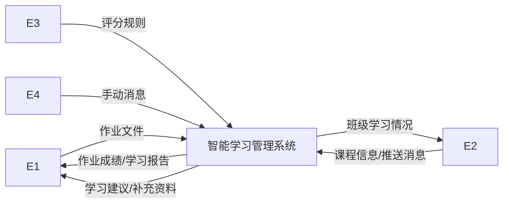
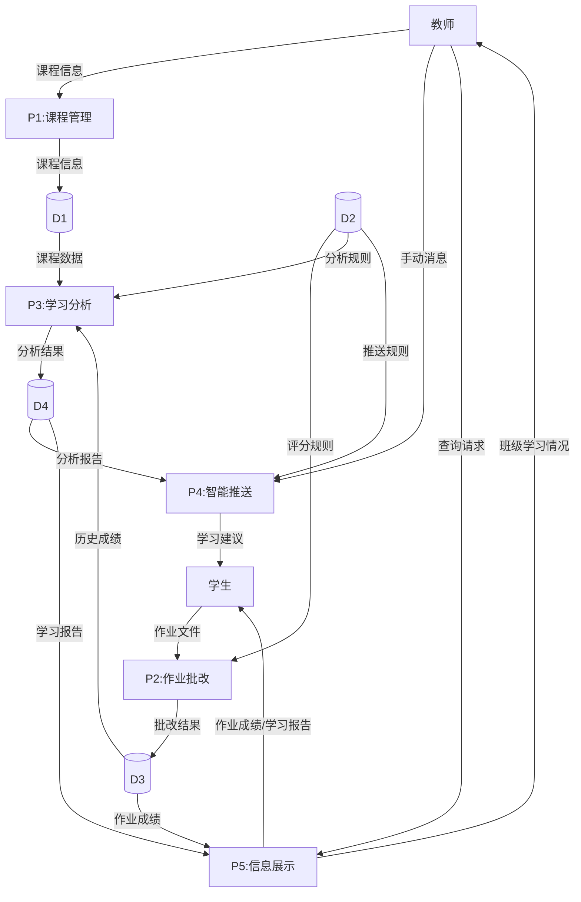
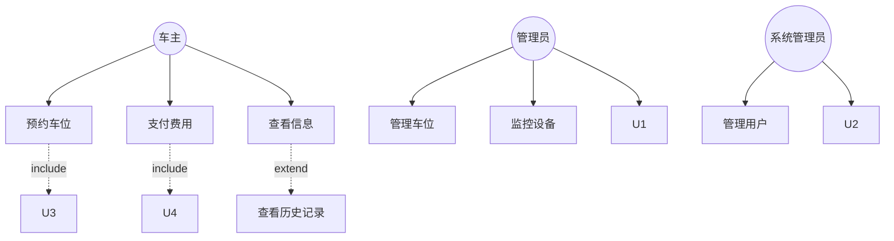
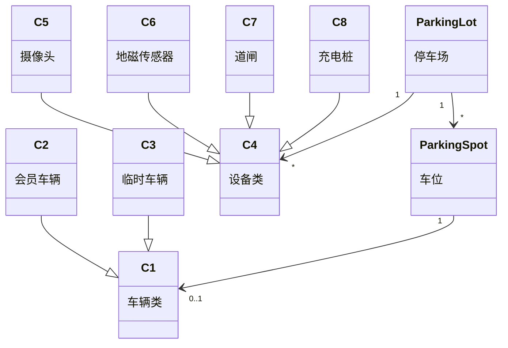
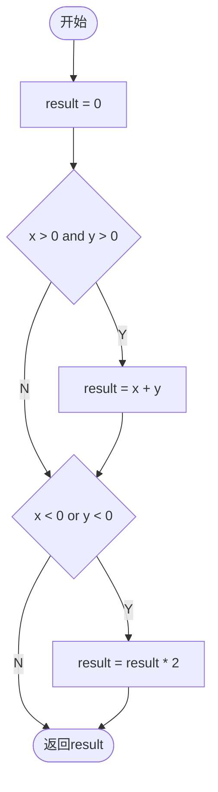

# 软件工程期末模拟试卷

**考试时间：120分钟**  
**总分：100分**

---

## 📋 考生须知

1. 本试卷共6道大题，请在答题前仔细阅读题目要求
2. 画图题请保持图形清晰，标注完整
3. 所有答案请写在答题纸上，试卷上作答无效
4. 考试结束后请将试卷和答题纸一并上交

---

## 第一题 数据流图分析（15分）

某在线教育平台欲开发一套智能学习管理系统，以提高教学质量和学习效率。该系统的主要功能如下：

1. **课程管理**。教师可以创建和维护课程信息、教学大纲、课件资料等，系统将这些信息存储到课程资料库中。

2. **作业批改**。学生提交作业后，系统自动接收作业文件，并根据评分规则进行自动批改。批改结果存储到作业成绩库中，同时生成学习分析报告。

3. **学习分析**。系统从作业成绩库和课程资料库中读取历史数据，根据分析规则进行数据挖掘和统计分析，生成学习趋势预测和个性化学习建议。分析结果存储到分析报告库中。

4. **智能推送**。系统根据分析报告和推送规则，自动向学生推送学习建议和补充资料；教师也可以手动向指定学生推送消息。

5. **信息展示**。实时向学生展示作业成绩和学习分析报告；向教师展示班级整体学习情况，或根据教师请求展示特定信息。

现采用结构化方法对该系统进行分析与设计，需要绘制数据流图。

### 问题1.1（4分）

请根据系统说明，给出**上下文数据流图**中的外部实体E1~E4的名称。

**请写出：**
- E1：_______________
- E2：_______________
- E3：_______________
- E4：_______________

### 问题1.2（4分）

请根据系统说明，给出**0层数据流图**中的数据存储D1~D4的名称。

**请写出：**
- D1：_______________
- D2：_______________
- D3：_______________
- D4：_______________

### 问题1.3（4分）

根据说明和上述数据流图，补充0层数据流图中**缺失的数据流**及其起点和终点。

| 数据流名称 | 起点 | 终点 |
|-----------|------|------|
| ① | | |
| ② | | |
| ③ | | |
| ④ | | |

### 问题1.4（3分）

根据系统说明，"学习分析"（P3）可以分解为哪些子加工？

在进一步分解数据流图时，需要注意哪三种常见的错误？

**答：**

---

## 第二题 可行性分析（20分）

某医疗机构计划开发一套智能诊断辅助系统，用于辅助医生进行疾病诊断。该系统将使用人工智能技术分析患者的症状、检查报告和历史病例，为医生提供诊断建议和治疗方案参考。

项目预算为300万元，预计开发周期为18个月。系统建成后，预计每年可以：
- 提高诊断准确率15%，减少误诊损失约100万元/年
- 节省医生诊断时间30%，相当于增加经济效益80万元/年
- 减少重复检查20%，节约医疗成本60万元/年

但项目也面临一些挑战：
- 需要处理大量医疗影像和病历数据，对算法和硬件要求较高
- 医生群体年龄偏大，对新系统接受度存在不确定性
- 医疗数据涉及隐私保护，需要符合相关法律法规
- 使用第三方AI算法库可能涉及知识产权问题

### 问题2.1（5分）

从**技术可行性**角度，分析该项目面临的主要技术挑战有哪些？（至少列举3点）

**答：**

### 问题2.2（6分）

从**经济可行性**角度，计算：
1. 该项目的投资回报期是多少年？（计算过程）
2. 5年内的总收益是多少？
3. 该项目在经济上是否可行？请说明理由。

**答：**

### 问题2.3（5分）

从**操作可行性**角度，分析该系统在实际使用中可能遇到哪些问题？应该如何解决？（至少列举2个问题及解决方案）

**答：**

### 问题2.4（4分）

从**法律可行性**角度，该项目需要注意哪些法律和合规问题？

**答：**

---

## 第三题 面向对象分析与设计（30分）

某公司计划开发一个智能停车场管理系统。系统的主要功能和特性如下：

**车辆管理：**
系统需要管理不同类型的车辆，包括普通车辆、会员车辆和临时车辆。所有车辆都有车牌号、进场时间等基本信息。会员车辆还有会员等级、优惠信息等；临时车辆需要记录预计停车时长。

**车位管理：**
停车场有多个停车区域（地下车库、地面停车场），每个区域包含多个车位。车位有编号、状态（空闲、占用、预留）、类型（普通、充电、残疾人专用）等属性。

**设备管理：**
停车场配备了多种智能设备：
- 摄像头（Camera）：用于识别车牌，安装在入口和出口
- 地磁传感器（MagneticSensor）：检测车位是否被占用
- 道闸（Barrier）：控制车辆进出
- 充电桩（ChargingPile）：为电动车充电

所有设备都有设备ID、状态、位置等基本属性，并都需要定期维护。

**计费管理：**
系统根据不同的计费策略进行收费：
- 按时计费：临时车辆按小时收费
- 包月计费：会员车辆按月收费
- 充电计费：使用充电桩需要额外收费

**用户操作：**
- 车主可以通过手机APP预约车位、查看停车费用、在线支付
- 管理员可以管理车位、监控设备状态、生成统计报表
- 系统管理员可以管理用户权限、配置系统参数

现采用面向对象方法进行系统设计，得到如下用例图和类图。

### 问题3.1（8分）

根据系统描述，给出下图中的用例U1~U4的名称，并说明它们与其他用例之间是什么关系。

**请写出：**
- U1：_______________，与_______________用例是_______________关系
- U2：_______________，与_______________用例是_______________关系
- U3：_______________，与_______________用例是_______________关系
- U4：_______________，与_______________用例是_______________关系

### 问题3.2（12分）

根据系统描述，给出下图中的类C1~C8的名称。

**请识别类名（已标注的除外）：**
- C1：_______________
- C2：_______________
- C3：_______________
- C4：_______________
- C5：_______________
- C6：_______________
- C7：_______________
- C8：_______________

### 问题3.3（10分）

根据系统描述，说明以下类之间的关系类型及其含义：

1. C2（会员车辆）与C1（车辆）之间是什么关系？用什么符号表示？
2. ParkingLot（停车场）与ParkingSpot（车位）之间是什么关系？多重性"1"和"*"表示什么含义？
3. ParkingSpot（车位）与C1（车辆）之间是什么关系？多重性"0..1"表示什么含义？

**答：**

---

## 第四题 状态图绘制（10分）

某电商平台的订单状态转换规则如下：

1. 用户下单后，订单进入"待支付"状态
2. 从"待支付"状态：
   - 如果用户在30分钟内完成支付，订单转为"待发货"状态
   - 如果用户取消订单或超时未支付，订单转为"已取消"状态
3. 从"待发货"状态：
   - 商家发货后，订单转为"待收货"状态
   - 如果用户申请退款且商家同意，订单转为"退款中"状态
4. 从"待收货"状态：
   - 用户确认收货后，订单转为"已完成"状态
   - 如果用户申请退货且商家同意，订单转为"退货中"状态
5. 从"退款中"状态：退款完成后，订单转为"已取消"状态
6. 从"退货中"状态：退货成功后，订单转为"已取消"状态

**请画出完整的订单状态图，要求：**
1. 标明所有状态
2. 标注状态转换的触发事件和条件
3. 明确标识初始状态和终止状态

**答：**（请在答题纸上绘制）

---

## 第五题 项目管理与关键路径（10分）

某软件开发项目包含以下活动：

| 活动代号 | 活动名称 | 前置活动 | 持续时间（天） |
|---------|---------|---------|---------------|
| A | 需求分析 | - | 5 |
| B | 系统设计 | A | 8 |
| C | 数据库设计 | A | 6 |
| D | 前端开发 | B | 10 |
| E | 后端开发 | B, C | 12 |
| F | 接口开发 | C | 7 |
| G | 集成测试 | D, E, F | 8 |
| H | 用户验收 | G | 4 |

### 问题5.1（6分）

1. 该项目最少需要多少天完成？（要求画出网络图并计算关键路径）
2. 关键路径是什么？
3. 活动C、F的总时差分别是多少？

**答：**

### 问题5.2（4分）

计算活动D和活动F的以下时间参数：
- 最早开始时间（ES）
- 最晚开始时间（LS）
- 最早完成时间（EF）
- 最晚完成时间（LF）

**答：**

---

## 第六题 软件测试（15分）

### 问题6.1 等价类划分（5分）

某用户注册系统对密码有以下要求：
- 长度：8-20个字符
- 必须包含：至少一个大写字母、至少一个小写字母、至少一个数字
- 可选：可以包含特殊字符（!@#$%）
- 不能包含：用户名、连续3个以上相同字符

请对密码输入进行等价类划分，列出所有**有效等价类**和**无效等价类**，并为每个等价类设计至少一个测试用例。

**答：**

### 问题6.2 边界值分析（3分）

针对问题6.1中的密码长度要求（8-20个字符），请列出所有需要测试的边界值。

**答：**

### 问题6.3 判定表（4分）

某在线支付系统的折扣规则如下：
- 会员用户且订单金额≥200元：9折优惠
- 会员用户且订单金额<200元：9.5折优惠
- 非会员用户且订单金额≥200元：9.8折优惠
- 非会员用户且订单金额<200元：无折扣

请绘制判定表。

**答：**

### 问题6.4 白盒测试覆盖（3分）

对于以下程序流程：

请分别设计测试用例满足以下覆盖标准（只需写出测试数据）：
1. **语句覆盖**（至少覆盖所有语句一次）
2. **判定覆盖**（每个判定的真假分支都要覆盖）
3. **条件覆盖**（每个条件的真假都要出现）

**答：**

---

## 试卷结束

**请检查：**
- ✓ 所有题目是否都已作答
- ✓ 图形是否清晰完整
- ✓ 计算过程是否完整
- ✓ 姓名学号是否填写

**祝你考试顺利！**

